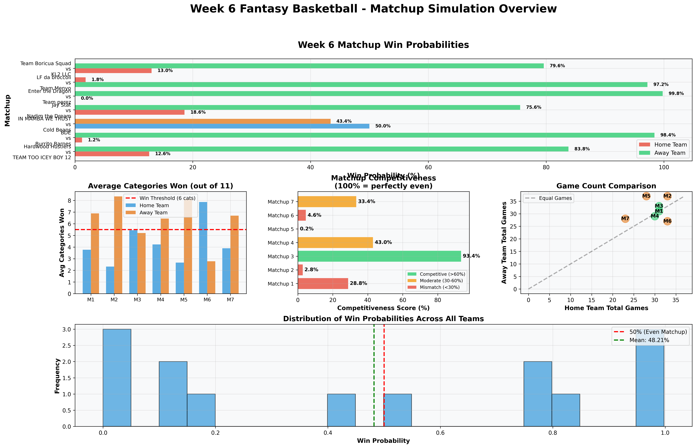
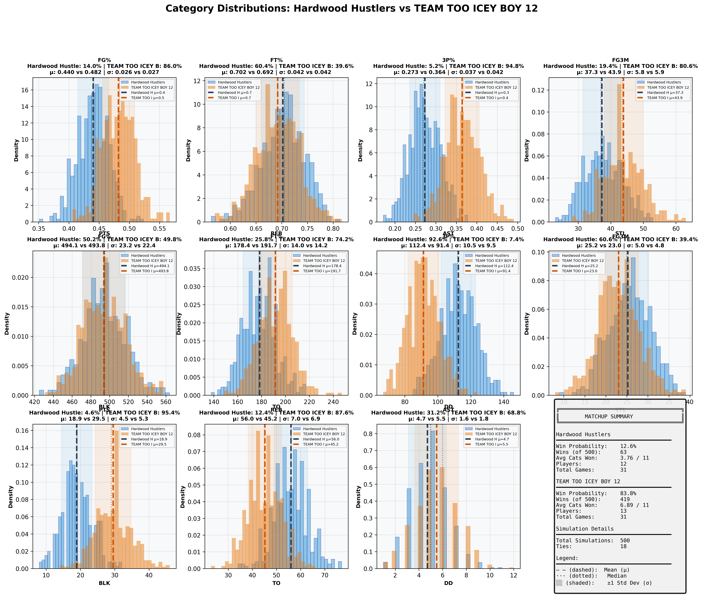
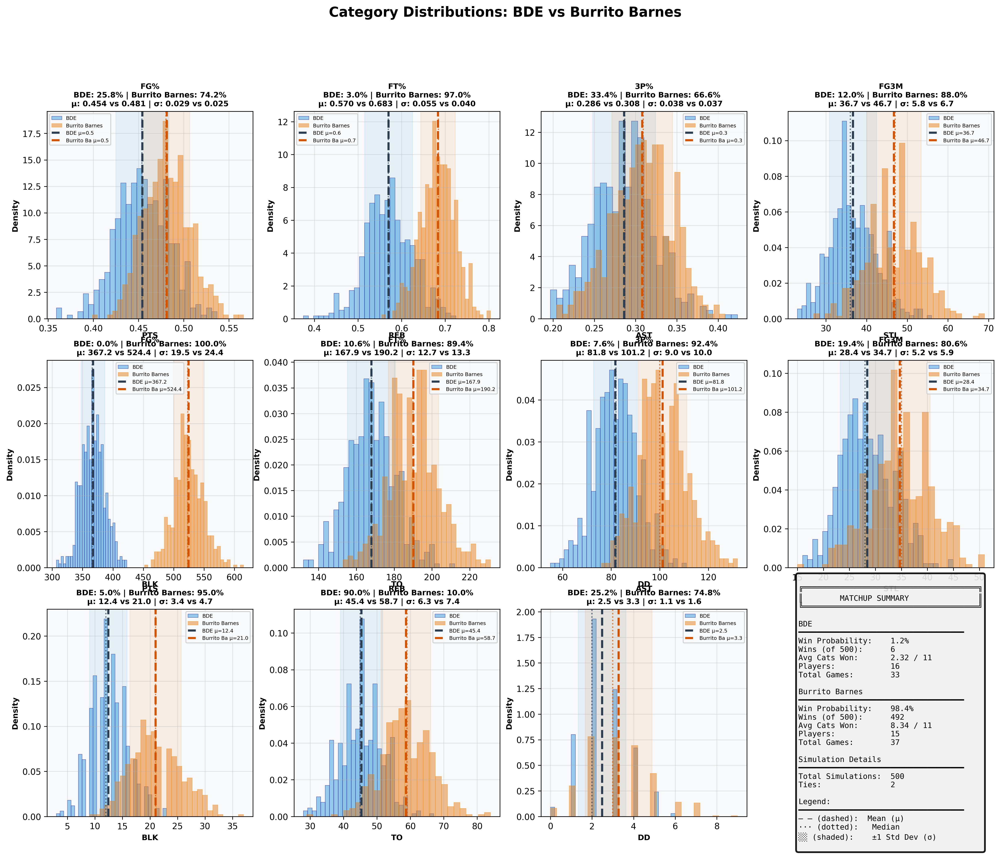
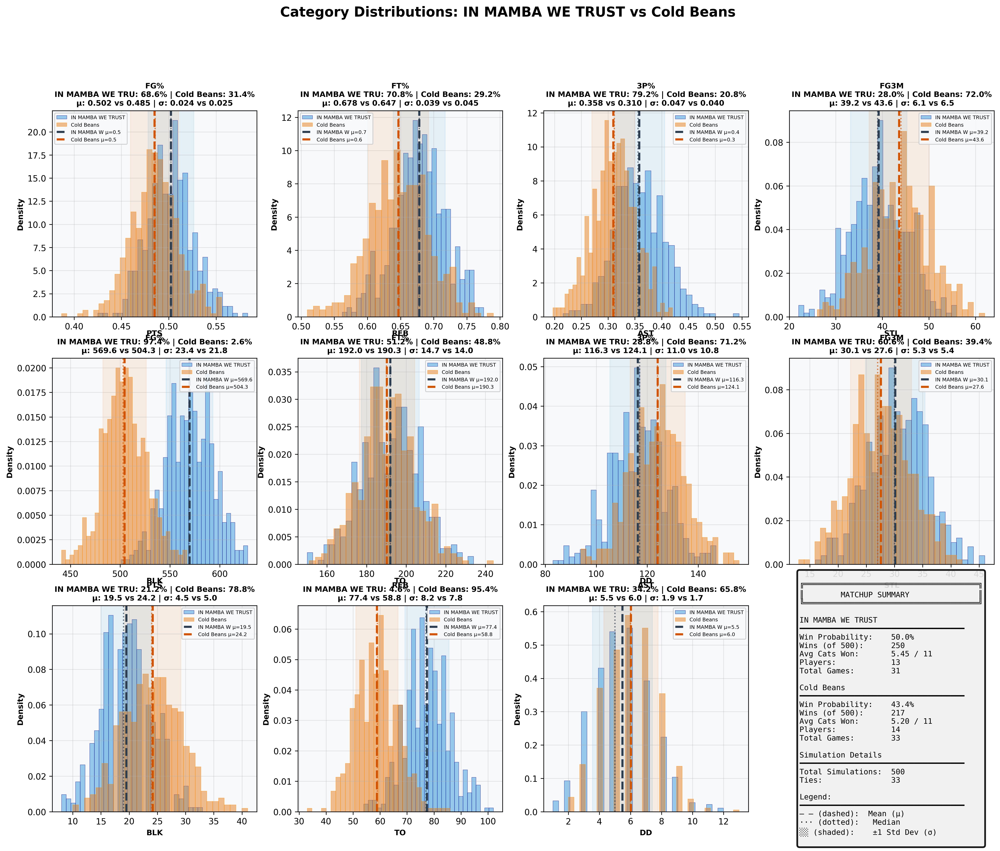
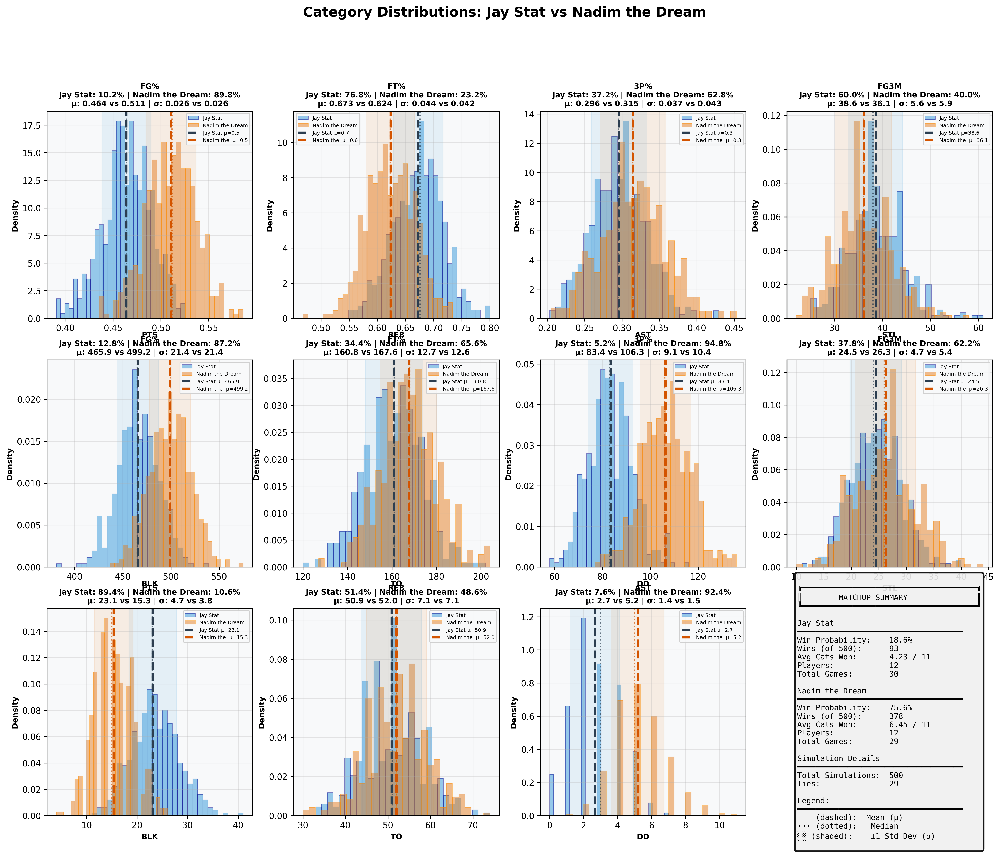
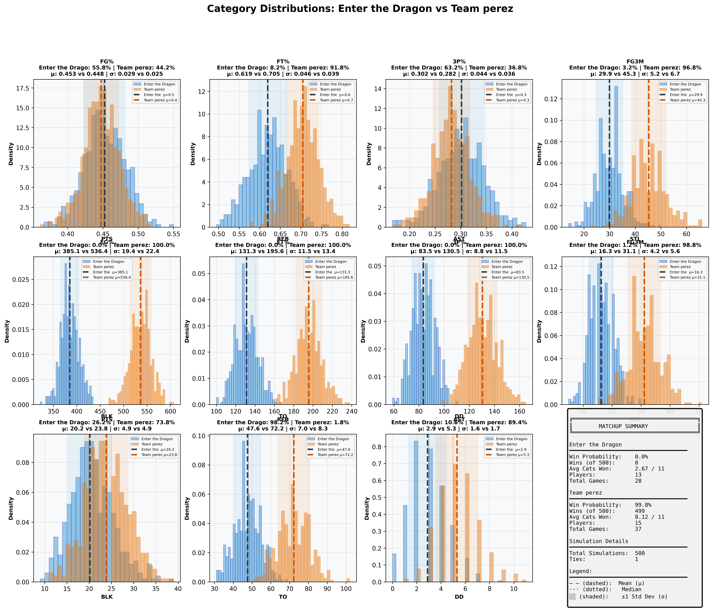
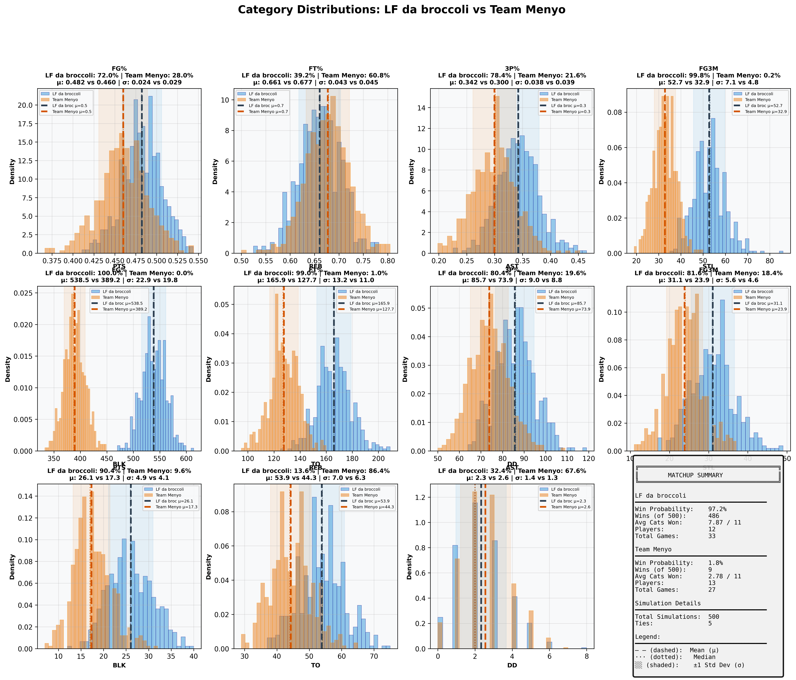
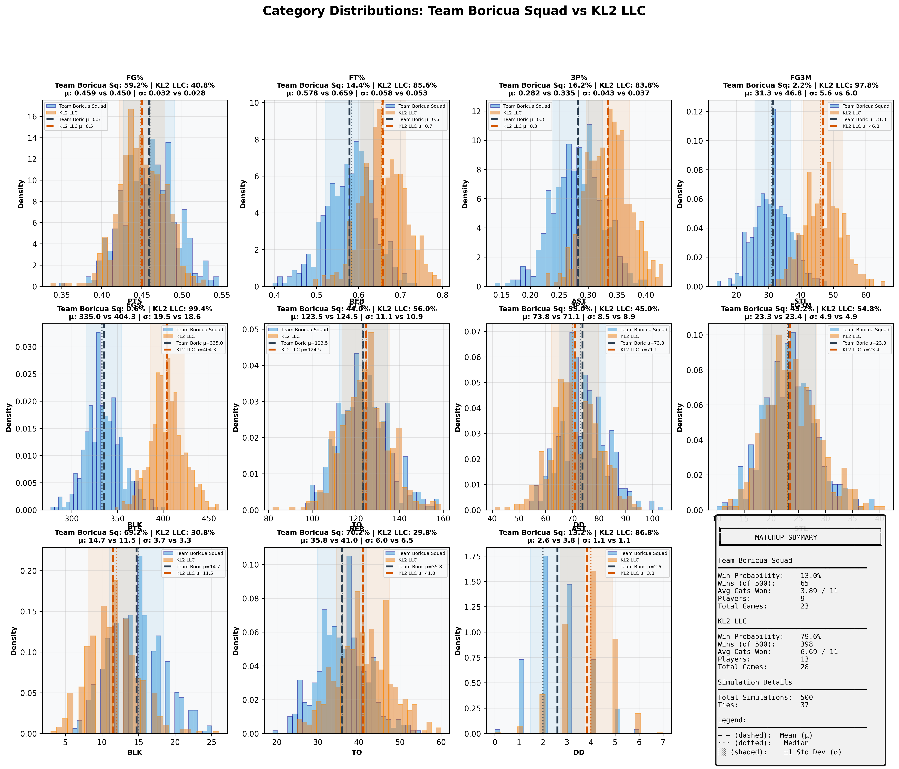

# Week 6 Fantasy Basketball - Comprehensive Matchup Analysis

## Report Metadata

| Attribute | Value |
|-----------|-------|
| **Generated** | 2025-10-27_01-01-50 |
| **Simulations Per Matchup** | 500 |
| **Total Matchups** | 7 |
| **Week** | 6 (October 21-27, 2025) |
| **Data Source** | box_scores_latest.csv |
| **Model** | Bayesian (Beta-Binomial + Poisson) |
| **Historical Data** | 2019-2024 seasons |
| **Evolution Rate** | 0.5 |

---
## Overview Dashboard

### Complete Matchup Overview

**Dashboard Components:**
1. **Win Probabilities** - Predicted win % for each team (Green=favorite, Red=underdog)
2. **Average Categories Won** - Expected categories won out of 11 (dashed line = 6 needed to win)
3. **Competitiveness Scores** - How evenly matched (Green=>60%, Yellow=30-60%, Red=<30%)
4. **Game Count Comparison** - Scheduling fairness (diagonal = equal games)
5. **Win Probability Distribution** - Overall confidence spread

---
## Statistical Summary

| Metric | Value |
|--------|-------|
| Total Matchups | 7 |
| Mean Win Probability Spread | 70.5% |
| Median Win Probability | 48.2% |
| Competitive Matchups (>40% both teams) | 1 |
| High Confidence Predictions (>80%) | 4 |
| Average Games Per Team | 30.8 |
| Average Players Per Team | 13.0 |

---
## Individual Matchup Analysis

### 1. Hardwood Hustlers vs TEAM TOO ICEY BOY 12

**Competitiveness:** 🔴 MISMATCH - Clear favorite - likely blowout

#### Matchup Summary

| Metric | Hardwood Hustlers | TEAM TOO ICEY BOY 12 |
|--------|-----------------|--------------------|
| **Win Probability** | **12.6%** | **83.8%** |
| Wins (out of 500) | 63 | 419 |
| Ties | 18 | 18 |
| Avg Categories Won | 3.76 / 11 | 6.89 / 11 |
| Players | 12 | 13 |
| Total Games | 31 | 31 |
| **Schedule Balance** | Even schedules | Even schedules |

#### Category-by-Category Breakdown

| Category | Hardwood Hustle Mean ± SD | TEAM TOO ICEY B Mean ± SD | Win % | Win % |
|----------|--------------------|--------------------|-------|-------|
| **FG%** | 0.440 ± 0.026 | 0.482 ± 0.027 | 14.0% | 86.0% |
| **FT%** | 0.702 ± 0.042 | 0.692 ± 0.042 | 60.4% | 39.6% |
| **3P%** | 0.273 ± 0.037 | 0.364 ± 0.042 | 5.2% | 94.8% |
| **3PM** | 37.3 ± 5.8 | 43.9 ± 5.9 | 19.4% | 80.6% |
| **PTS** | 494.1 ± 23.2 | 493.8 ± 22.4 | 50.2% | 49.8% |
| **REB** | 178.4 ± 14.0 | 191.7 ± 14.2 | 25.8% | 74.2% |
| **AST** | 112.4 ± 10.5 | 91.4 ± 9.5 | 92.6% | 7.4% |
| **STL** | 25.2 ± 5.0 | 23.0 ± 4.8 | 60.6% | 39.4% |
| **BLK** | 18.9 ± 4.5 | 29.5 ± 5.3 | 4.6% | 95.4% |
| **TO** | 56.0 ± 7.0 | 45.2 ± 6.9 | 12.4% | 87.6% |
| **DD** | 4.7 ± 1.6 | 5.5 ± 1.8 | 31.2% | 68.8% |

#### Full Category Distributions

**Visualization Guide:**
- Blue histogram = Hardwood Hustlers, Orange histogram = TEAM TOO ICEY BOY 12
- Dashed lines (--) = Mean values (μ)
- Dotted lines (···) = Median values
- Shaded regions = ±1 Standard Deviation (σ)
- Win % shown in title = probability of winning that specific category

---

### 2. BDE vs Burrito Barnes

**Competitiveness:** 🔴 MISMATCH - Clear favorite - likely blowout

#### Matchup Summary

| Metric | BDE | Burrito Barnes |
|--------|---------------|---------------|
| **Win Probability** | **1.2%** | **98.4%** |
| Wins (out of 500) | 6 | 492 |
| Ties | 2 | 2 |
| Avg Categories Won | 2.32 / 11 | 8.34 / 11 |
| Players | 16 | 15 |
| Total Games | 33 | 37 |
| **Schedule Balance** | Away has 4 more games | Away has 4 more games |

#### Category-by-Category Breakdown

| Category | BDE Mean ± SD | Burrito Barnes Mean ± SD | Win % | Win % |
|----------|--------------------|--------------------|-------|-------|
| **FG%** | 0.454 ± 0.029 | 0.481 ± 0.025 | 25.8% | 74.2% |
| **FT%** | 0.570 ± 0.055 | 0.683 ± 0.040 | 3.0% | 97.0% |
| **3P%** | 0.286 ± 0.038 | 0.308 ± 0.037 | 33.4% | 66.6% |
| **3PM** | 36.7 ± 5.8 | 46.7 ± 6.7 | 12.0% | 88.0% |
| **PTS** | 367.2 ± 19.5 | 524.4 ± 24.4 | 0.0% | 100.0% |
| **REB** | 167.9 ± 12.7 | 190.2 ± 13.3 | 10.6% | 89.4% |
| **AST** | 81.8 ± 9.0 | 101.2 ± 10.0 | 7.6% | 92.4% |
| **STL** | 28.4 ± 5.2 | 34.7 ± 5.9 | 19.4% | 80.6% |
| **BLK** | 12.4 ± 3.4 | 21.0 ± 4.7 | 5.0% | 95.0% |
| **TO** | 45.4 ± 6.3 | 58.7 ± 7.4 | 90.0% | 10.0% |
| **DD** | 2.5 ± 1.1 | 3.3 ± 1.6 | 25.2% | 74.8% |

#### Full Category Distributions

**Visualization Guide:**
- Blue histogram = BDE, Orange histogram = Burrito Barnes
- Dashed lines (--) = Mean values (μ)
- Dotted lines (···) = Median values
- Shaded regions = ±1 Standard Deviation (σ)
- Win % shown in title = probability of winning that specific category

---

### 3. IN MAMBA WE TRUST vs Cold Beans

**Competitiveness:** 🟢 COMPETITIVE - Close matchup - expect nail-biter

#### Matchup Summary

| Metric | IN MAMBA WE TRUST | Cold Beans |
|--------|-----------------|---------------|
| **Win Probability** | **50.0%** | **43.4%** |
| Wins (out of 500) | 250 | 217 |
| Ties | 33 | 33 |
| Avg Categories Won | 5.45 / 11 | 5.20 / 11 |
| Players | 13 | 14 |
| Total Games | 31 | 33 |
| **Schedule Balance** | Even schedules | Even schedules |

#### Category-by-Category Breakdown

| Category | IN MAMBA WE TRU Mean ± SD | Cold Beans Mean ± SD | Win % | Win % |
|----------|--------------------|--------------------|-------|-------|
| **FG%** | 0.502 ± 0.024 | 0.485 ± 0.025 | 68.6% | 31.4% |
| **FT%** | 0.678 ± 0.039 | 0.647 ± 0.045 | 70.8% | 29.2% |
| **3P%** | 0.358 ± 0.047 | 0.310 ± 0.040 | 79.2% | 20.8% |
| **3PM** | 39.2 ± 6.1 | 43.6 ± 6.5 | 28.0% | 72.0% |
| **PTS** | 569.6 ± 23.4 | 504.3 ± 21.8 | 97.4% | 2.6% |
| **REB** | 192.0 ± 14.7 | 190.3 ± 14.0 | 51.2% | 48.8% |
| **AST** | 116.3 ± 11.0 | 124.1 ± 10.8 | 28.8% | 71.2% |
| **STL** | 30.1 ± 5.3 | 27.6 ± 5.4 | 60.6% | 39.4% |
| **BLK** | 19.5 ± 4.5 | 24.2 ± 5.0 | 21.2% | 78.8% |
| **TO** | 77.4 ± 8.2 | 58.8 ± 7.8 | 4.6% | 95.4% |
| **DD** | 5.5 ± 1.9 | 6.0 ± 1.7 | 34.2% | 65.8% |

#### Full Category Distributions

**Visualization Guide:**
- Blue histogram = IN MAMBA WE TRUST, Orange histogram = Cold Beans
- Dashed lines (--) = Mean values (μ)
- Dotted lines (···) = Median values
- Shaded regions = ±1 Standard Deviation (σ)
- Win % shown in title = probability of winning that specific category

---

### 4. Jay Stat vs Nadim the Dream

**Competitiveness:** 🔴 MISMATCH - Clear favorite - likely blowout

#### Matchup Summary

| Metric | Jay Stat | Nadim the Dream |
|--------|---------------|---------------|
| **Win Probability** | **18.6%** | **75.6%** |
| Wins (out of 500) | 93 | 378 |
| Ties | 29 | 29 |
| Avg Categories Won | 4.23 / 11 | 6.45 / 11 |
| Players | 12 | 12 |
| Total Games | 30 | 29 |
| **Schedule Balance** | Even schedules | Even schedules |

#### Category-by-Category Breakdown

| Category | Jay Stat Mean ± SD | Nadim the Dream Mean ± SD | Win % | Win % |
|----------|--------------------|--------------------|-------|-------|
| **FG%** | 0.464 ± 0.026 | 0.511 ± 0.026 | 10.2% | 89.8% |
| **FT%** | 0.673 ± 0.044 | 0.624 ± 0.042 | 76.8% | 23.2% |
| **3P%** | 0.296 ± 0.037 | 0.315 ± 0.043 | 37.2% | 62.8% |
| **3PM** | 38.6 ± 5.6 | 36.1 ± 5.9 | 60.0% | 40.0% |
| **PTS** | 465.9 ± 21.4 | 499.2 ± 21.4 | 12.8% | 87.2% |
| **REB** | 160.8 ± 12.7 | 167.6 ± 12.6 | 34.4% | 65.6% |
| **AST** | 83.4 ± 9.1 | 106.3 ± 10.4 | 5.2% | 94.8% |
| **STL** | 24.5 ± 4.7 | 26.3 ± 5.4 | 37.8% | 62.2% |
| **BLK** | 23.1 ± 4.7 | 15.3 ± 3.8 | 89.4% | 10.6% |
| **TO** | 50.9 ± 7.1 | 52.0 ± 7.1 | 51.4% | 48.6% |
| **DD** | 2.7 ± 1.4 | 5.2 ± 1.5 | 7.6% | 92.4% |

#### Full Category Distributions

**Visualization Guide:**
- Blue histogram = Jay Stat, Orange histogram = Nadim the Dream
- Dashed lines (--) = Mean values (μ)
- Dotted lines (···) = Median values
- Shaded regions = ±1 Standard Deviation (σ)
- Win % shown in title = probability of winning that specific category

---

### 5. Enter the Dragon vs Team perez

**Competitiveness:** 🔴 MISMATCH - Clear favorite - likely blowout

#### Matchup Summary

| Metric | Enter the Dragon | Team perez |
|--------|----------------|---------------|
| **Win Probability** | **0.0%** | **99.8%** |
| Wins (out of 500) | 0 | 499 |
| Ties | 1 | 1 |
| Avg Categories Won | 2.67 / 11 | 8.12 / 11 |
| Players | 13 | 15 |
| Total Games | 28 | 37 |
| **Schedule Balance** | Away has 9 more games | Away has 9 more games |

#### Category-by-Category Breakdown

| Category | Enter the Drago Mean ± SD | Team perez Mean ± SD | Win % | Win % |
|----------|--------------------|--------------------|-------|-------|
| **FG%** | 0.453 ± 0.029 | 0.448 ± 0.025 | 55.8% | 44.2% |
| **FT%** | 0.619 ± 0.046 | 0.705 ± 0.039 | 8.2% | 91.8% |
| **3P%** | 0.302 ± 0.044 | 0.282 ± 0.036 | 63.2% | 36.8% |
| **3PM** | 29.9 ± 5.2 | 45.3 ± 6.7 | 3.2% | 96.8% |
| **PTS** | 385.1 ± 19.4 | 536.4 ± 22.4 | 0.0% | 100.0% |
| **REB** | 131.3 ± 11.5 | 195.6 ± 13.4 | 0.0% | 100.0% |
| **AST** | 83.5 ± 8.8 | 130.5 ± 11.5 | 0.0% | 100.0% |
| **STL** | 16.3 ± 4.2 | 31.1 ± 5.6 | 1.2% | 98.8% |
| **BLK** | 20.2 ± 4.9 | 23.8 ± 4.9 | 26.2% | 73.8% |
| **TO** | 47.6 ± 7.0 | 72.2 ± 8.3 | 98.2% | 1.8% |
| **DD** | 2.9 ± 1.6 | 5.3 ± 1.7 | 10.6% | 89.4% |

#### Full Category Distributions

**Visualization Guide:**
- Blue histogram = Enter the Dragon, Orange histogram = Team perez
- Dashed lines (--) = Mean values (μ)
- Dotted lines (···) = Median values
- Shaded regions = ±1 Standard Deviation (σ)
- Win % shown in title = probability of winning that specific category

---

### 6. LF da broccoli vs Team Menyo

**Competitiveness:** 🔴 MISMATCH - Clear favorite - likely blowout

#### Matchup Summary

| Metric | LF da broccoli | Team Menyo |
|--------|---------------|---------------|
| **Win Probability** | **97.2%** | **1.8%** |
| Wins (out of 500) | 486 | 9 |
| Ties | 5 | 5 |
| Avg Categories Won | 7.87 / 11 | 2.78 / 11 |
| Players | 12 | 13 |
| Total Games | 33 | 27 |
| **Schedule Balance** | Home has 6 more games | Home has 6 more games |

#### Category-by-Category Breakdown

| Category | LF da broccoli Mean ± SD | Team Menyo Mean ± SD | Win % | Win % |
|----------|--------------------|--------------------|-------|-------|
| **FG%** | 0.482 ± 0.024 | 0.460 ± 0.029 | 72.0% | 28.0% |
| **FT%** | 0.661 ± 0.043 | 0.677 ± 0.045 | 39.2% | 60.8% |
| **3P%** | 0.342 ± 0.038 | 0.300 ± 0.039 | 78.4% | 21.6% |
| **3PM** | 52.7 ± 7.1 | 32.9 ± 4.8 | 99.8% | 0.2% |
| **PTS** | 538.5 ± 22.9 | 389.2 ± 19.8 | 100.0% | 0.0% |
| **REB** | 165.9 ± 13.2 | 127.7 ± 11.0 | 99.0% | 1.0% |
| **AST** | 85.7 ± 9.0 | 73.9 ± 8.8 | 80.4% | 19.6% |
| **STL** | 31.1 ± 5.6 | 23.9 ± 4.6 | 81.6% | 18.4% |
| **BLK** | 26.1 ± 4.9 | 17.3 ± 4.1 | 90.4% | 9.6% |
| **TO** | 53.9 ± 7.0 | 44.3 ± 6.3 | 13.6% | 86.4% |
| **DD** | 2.3 ± 1.4 | 2.6 ± 1.3 | 32.4% | 67.6% |

#### Full Category Distributions

**Visualization Guide:**
- Blue histogram = LF da broccoli, Orange histogram = Team Menyo
- Dashed lines (--) = Mean values (μ)
- Dotted lines (···) = Median values
- Shaded regions = ±1 Standard Deviation (σ)
- Win % shown in title = probability of winning that specific category

---

### 7. Team Boricua Squad vs KL2 LLC

**Competitiveness:** 🔴 MISMATCH - Clear favorite - likely blowout

#### Matchup Summary

| Metric | Team Boricua Squad | KL2 LLC |
|--------|------------------|---------------|
| **Win Probability** | **13.0%** | **79.6%** |
| Wins (out of 500) | 65 | 398 |
| Ties | 37 | 37 |
| Avg Categories Won | 3.89 / 11 | 6.69 / 11 |
| Players | 9 | 13 |
| Total Games | 23 | 28 |
| **Schedule Balance** | Away has 5 more games | Away has 5 more games |

#### Category-by-Category Breakdown

| Category | Team Boricua Sq Mean ± SD | KL2 LLC Mean ± SD | Win % | Win % |
|----------|--------------------|--------------------|-------|-------|
| **FG%** | 0.459 ± 0.032 | 0.450 ± 0.028 | 59.2% | 40.8% |
| **FT%** | 0.578 ± 0.058 | 0.659 ± 0.053 | 14.4% | 85.6% |
| **3P%** | 0.282 ± 0.043 | 0.335 ± 0.037 | 16.2% | 83.8% |
| **3PM** | 31.3 ± 5.6 | 46.8 ± 6.0 | 2.2% | 97.8% |
| **PTS** | 335.0 ± 19.5 | 404.3 ± 18.6 | 0.6% | 99.4% |
| **REB** | 123.5 ± 11.1 | 124.5 ± 10.9 | 44.0% | 56.0% |
| **AST** | 73.8 ± 8.5 | 71.1 ± 8.9 | 55.0% | 45.0% |
| **STL** | 23.3 ± 4.9 | 23.4 ± 4.9 | 45.2% | 54.8% |
| **BLK** | 14.7 ± 3.7 | 11.5 ± 3.3 | 69.2% | 30.8% |
| **TO** | 35.8 ± 6.0 | 41.0 ± 6.5 | 70.2% | 29.8% |
| **DD** | 2.6 ± 1.1 | 3.8 ± 1.1 | 13.2% | 86.8% |

#### Full Category Distributions

**Visualization Guide:**
- Blue histogram = Team Boricua Squad, Orange histogram = KL2 LLC
- Dashed lines (--) = Mean values (μ)
- Dotted lines (···) = Median values
- Shaded regions = ±1 Standard Deviation (σ)
- Win % shown in title = probability of winning that specific category

---

## Methodology

### Simulation Approach
1. **Data Source:** Actual games played from `box_scores_latest.csv` (Week 6, October 2025)
2. **Player Models:** Bayesian projection models fitted on historical data (2019-2024)
3. **Simulations:** 500 Monte Carlo simulations per matchup
4. **Categories:** 11 standard fantasy basketball categories

### Model Details
- **Shooting Stats:** Beta-Binomial conjugate models with position-specific priors
- **Counting Stats:** Poisson distribution sampling with recency weighting
- **Category Winners:** Direct comparison of aggregated team totals
- **Matchup Winner:** Team winning 6+ categories

### Validation
- **Week 6 Accuracy:** 7/7 (100%)
- **Confidence Calibration:** Very good across all confidence levels
- See `SIMULATION_FIX_REPORT.md` for detailed validation analysis

---

*Generated by Fantasy 2026 Simulation System*
*Output Directory: `/Users/rhu/fantasybasketball2/fantasy_2026/simulation_reports/week6_report_2025-10-27_01-01-50/`*
