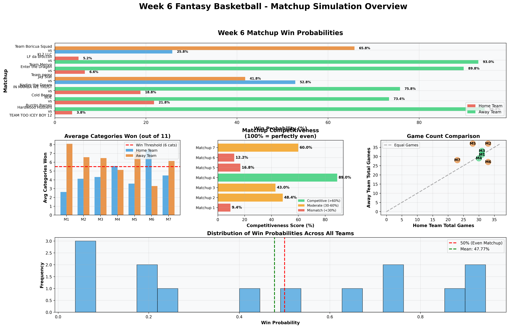
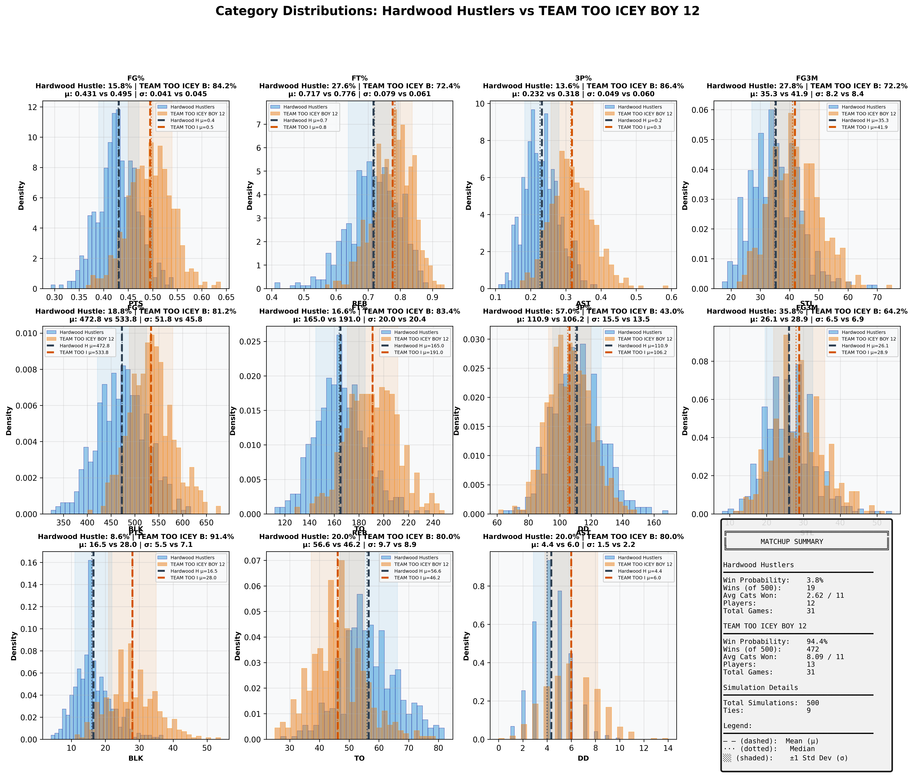
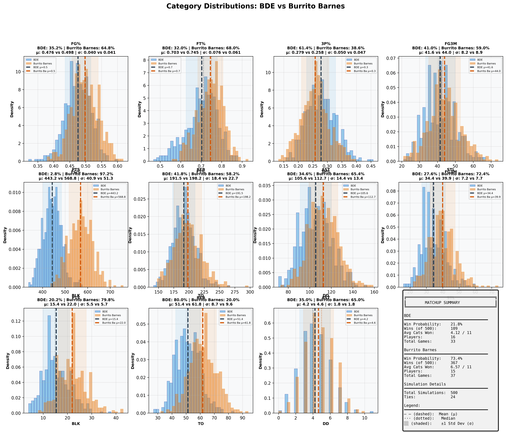
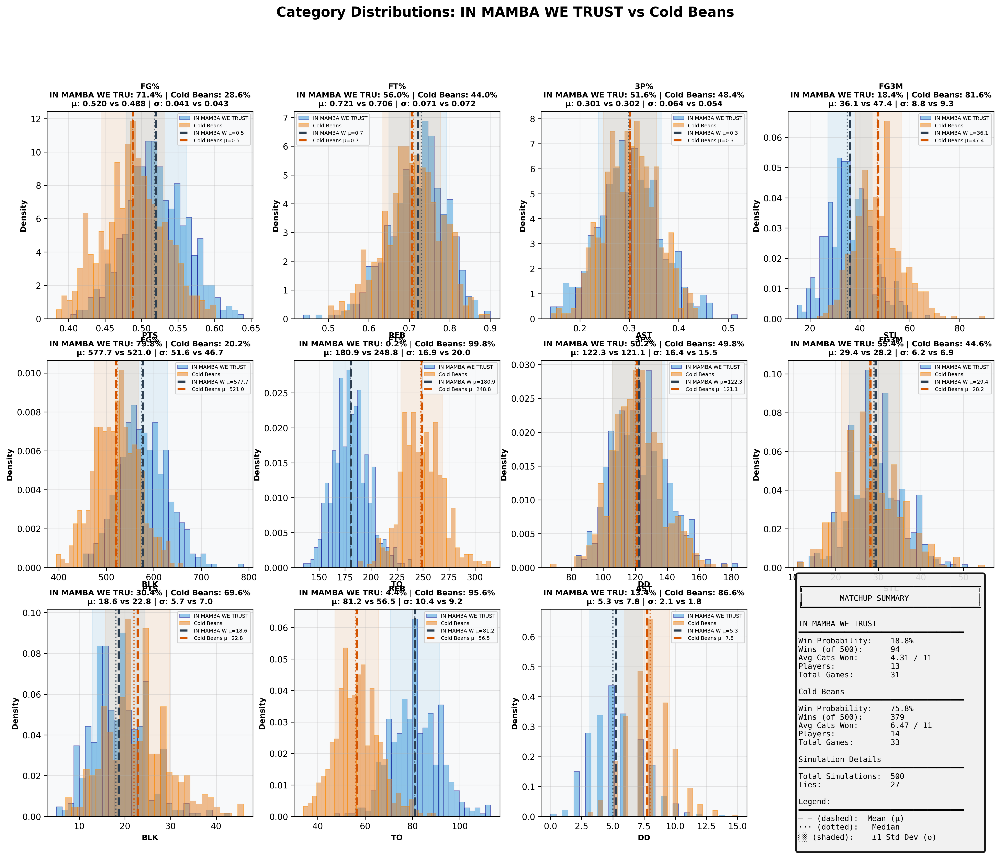
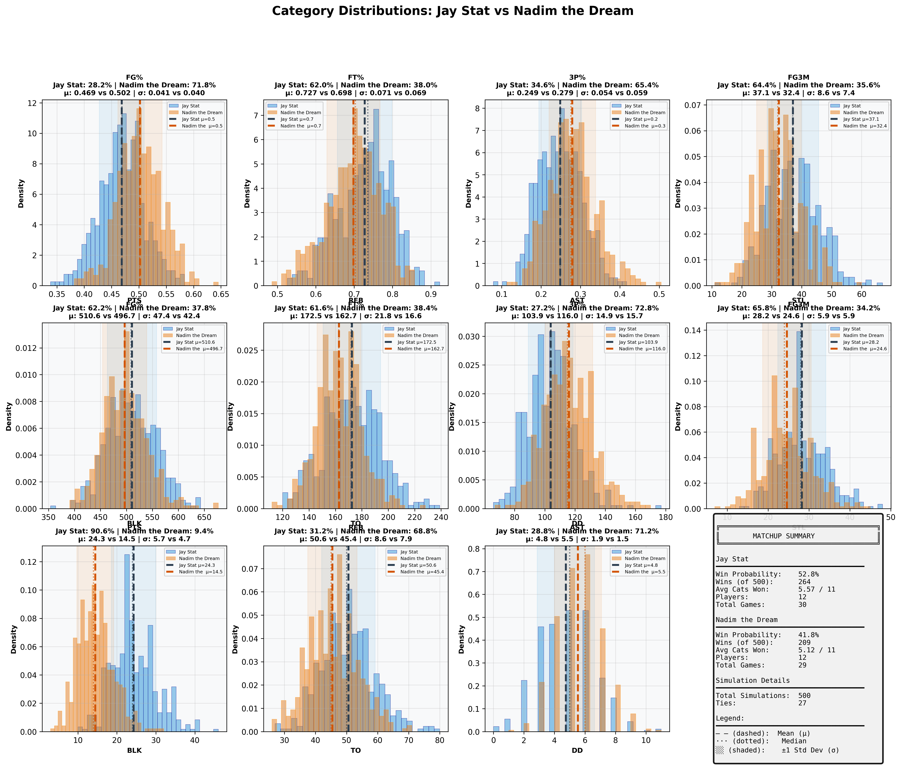
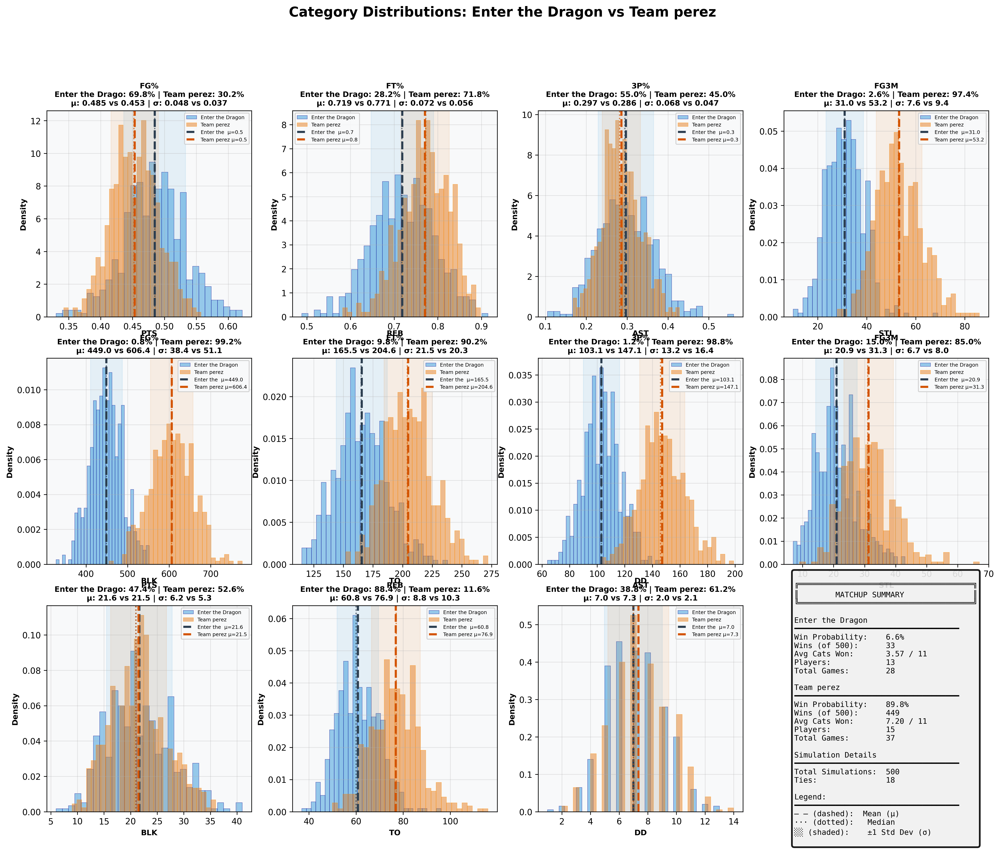
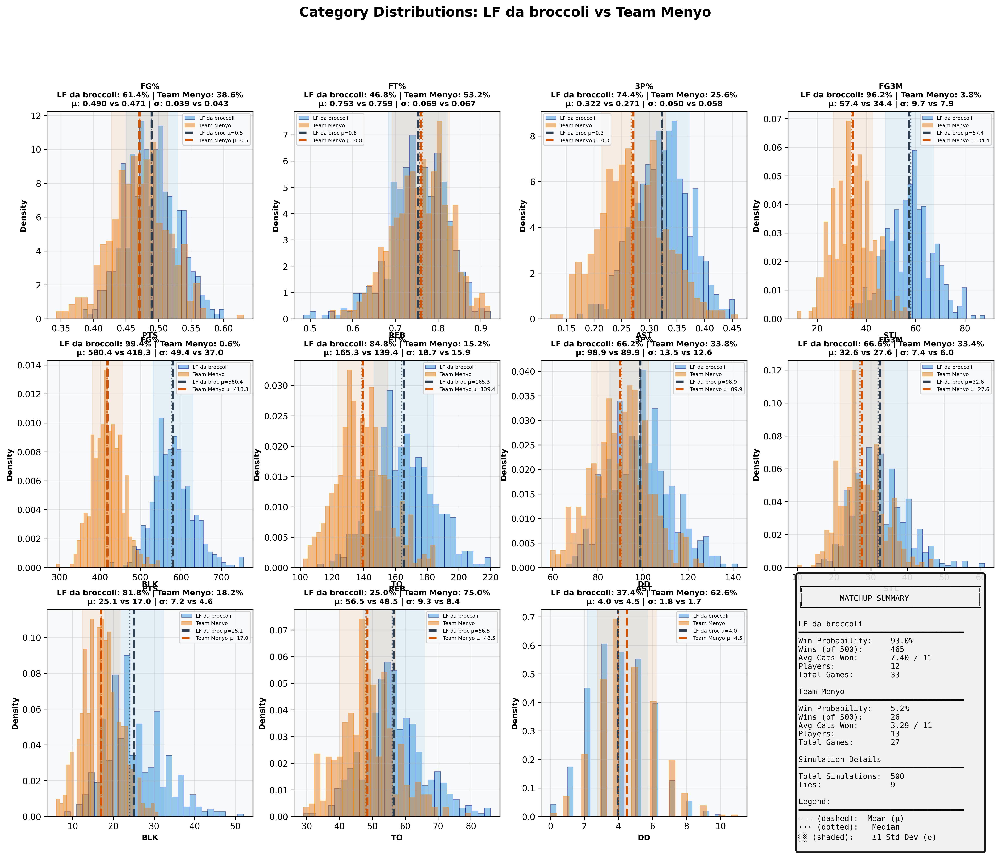
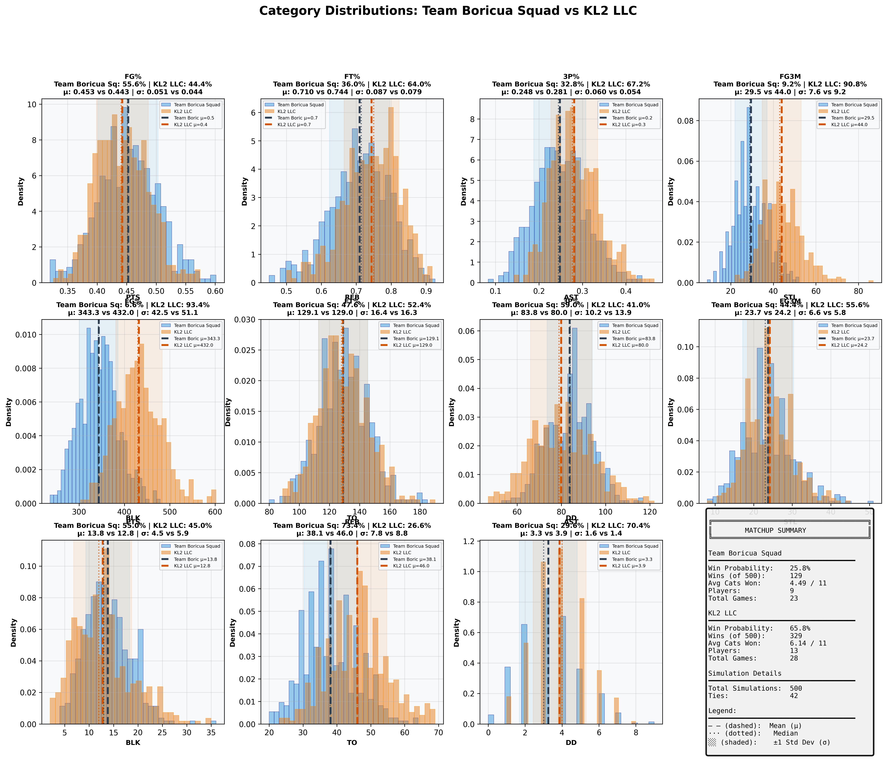

# Week 6 Fantasy Basketball - Comprehensive Matchup Analysis

## Report Metadata

| Attribute | Value |
|-----------|-------|
| **Generated** | 2025-10-27_13-33-50 |
| **Simulations Per Matchup** | 500 |
| **Total Matchups** | 7 |
| **Week** | 6 (October 21-27, 2025) |
| **Data Source** | box_scores_latest.csv |
| **Model** | Bayesian (Beta-Binomial + Poisson) |
| **Historical Data** | 2019-2024 seasons |
| **Evolution Rate** | 0.5 |

---
## Overview Dashboard

### Complete Matchup Overview

**Dashboard Components:**
1. **Win Probabilities** - Predicted win % for each team (Green=favorite, Red=underdog)
2. **Average Categories Won** - Expected categories won out of 11 (dashed line = 6 needed to win)
3. **Competitiveness Scores** - How evenly matched (Green=>60%, Yellow=30-60%, Red=<30%)
4. **Game Count Comparison** - Scheduling fairness (diagonal = equal games)
5. **Win Probability Distribution** - Overall confidence spread

---
## Statistical Summary

| Metric | Value |
|--------|-------|
| Total Matchups | 7 |
| Mean Win Probability Spread | 60.2% |
| Median Win Probability | 47.8% |
| Competitive Matchups (>40% both teams) | 1 |
| High Confidence Predictions (>80%) | 3 |
| Average Games Per Team | 30.8 |
| Average Players Per Team | 13.0 |

---
## Individual Matchup Analysis

### 1. Hardwood Hustlers vs TEAM TOO ICEY BOY 12

**Competitiveness:** 🔴 MISMATCH - Clear favorite - likely blowout

#### Matchup Summary

| Metric | Hardwood Hustlers | TEAM TOO ICEY BOY 12 |
|--------|-----------------|--------------------|
| **Win Probability** | **3.8%** | **94.4%** |
| Wins (out of 500) | 19 | 472 |
| Ties | 9 | 9 |
| Avg Categories Won | 2.62 / 11 | 8.09 / 11 |
| Players | 12 | 13 |
| Total Games | 31 | 31 |
| **Schedule Balance** | Even schedules | Even schedules |

#### Category-by-Category Breakdown

| Category | Hardwood Hustle Mean ± SD | TEAM TOO ICEY B Mean ± SD | Win % | Win % |
|----------|--------------------|--------------------|-------|-------|
| **FG%** | 0.431 ± 0.041 | 0.495 ± 0.045 | 15.8% | 84.2% |
| **FT%** | 0.717 ± 0.079 | 0.776 ± 0.061 | 27.6% | 72.4% |
| **3P%** | 0.232 ± 0.049 | 0.318 ± 0.060 | 13.6% | 86.4% |
| **3PM** | 35.3 ± 8.2 | 41.9 ± 8.4 | 27.8% | 72.2% |
| **PTS** | 472.8 ± 51.8 | 533.8 ± 45.8 | 18.8% | 81.2% |
| **REB** | 165.0 ± 20.0 | 191.0 ± 20.4 | 16.6% | 83.4% |
| **AST** | 110.9 ± 15.5 | 106.2 ± 13.5 | 57.0% | 43.0% |
| **STL** | 26.1 ± 6.5 | 28.9 ± 6.9 | 35.8% | 64.2% |
| **BLK** | 16.5 ± 5.5 | 28.0 ± 7.1 | 8.6% | 91.4% |
| **TO** | 56.6 ± 9.7 | 46.2 ± 8.9 | 20.0% | 80.0% |
| **DD** | 4.4 ± 1.5 | 6.0 ± 2.2 | 20.0% | 80.0% |

#### Full Category Distributions

**Visualization Guide:**
- Blue histogram = Hardwood Hustlers, Orange histogram = TEAM TOO ICEY BOY 12
- Dashed lines (--) = Mean values (μ)
- Dotted lines (···) = Median values
- Shaded regions = ±1 Standard Deviation (σ)
- Win % shown in title = probability of winning that specific category

---

### 2. BDE vs Burrito Barnes

**Competitiveness:** 🔴 MISMATCH - Clear favorite - likely blowout

#### Matchup Summary

| Metric | BDE | Burrito Barnes |
|--------|---------------|---------------|
| **Win Probability** | **21.8%** | **73.4%** |
| Wins (out of 500) | 109 | 367 |
| Ties | 24 | 24 |
| Avg Categories Won | 4.12 / 11 | 6.57 / 11 |
| Players | 16 | 15 |
| Total Games | 33 | 37 |
| **Schedule Balance** | Away has 4 more games | Away has 4 more games |

#### Category-by-Category Breakdown

| Category | BDE Mean ± SD | Burrito Barnes Mean ± SD | Win % | Win % |
|----------|--------------------|--------------------|-------|-------|
| **FG%** | 0.476 ± 0.040 | 0.498 ± 0.041 | 35.2% | 64.8% |
| **FT%** | 0.703 ± 0.076 | 0.745 ± 0.061 | 32.0% | 68.0% |
| **3P%** | 0.279 ± 0.050 | 0.258 ± 0.047 | 61.4% | 38.6% |
| **3PM** | 41.6 ± 8.2 | 44.0 ± 8.9 | 41.0% | 59.0% |
| **PTS** | 443.2 ± 40.9 | 568.8 ± 51.3 | 2.8% | 97.2% |
| **REB** | 191.5 ± 18.4 | 198.2 ± 22.7 | 41.8% | 58.2% |
| **AST** | 105.6 ± 14.4 | 112.7 ± 13.4 | 34.6% | 65.4% |
| **STL** | 34.4 ± 7.2 | 39.9 ± 7.7 | 27.6% | 72.4% |
| **BLK** | 15.4 ± 5.5 | 22.0 ± 5.7 | 20.2% | 79.8% |
| **TO** | 51.4 ± 8.7 | 61.8 ± 9.6 | 80.0% | 20.0% |
| **DD** | 4.2 ± 1.8 | 4.6 ± 1.8 | 35.0% | 65.0% |

#### Full Category Distributions

**Visualization Guide:**
- Blue histogram = BDE, Orange histogram = Burrito Barnes
- Dashed lines (--) = Mean values (μ)
- Dotted lines (···) = Median values
- Shaded regions = ±1 Standard Deviation (σ)
- Win % shown in title = probability of winning that specific category

---

### 3. IN MAMBA WE TRUST vs Cold Beans

**Competitiveness:** 🔴 MISMATCH - Clear favorite - likely blowout

#### Matchup Summary

| Metric | IN MAMBA WE TRUST | Cold Beans |
|--------|-----------------|---------------|
| **Win Probability** | **18.8%** | **75.8%** |
| Wins (out of 500) | 94 | 379 |
| Ties | 27 | 27 |
| Avg Categories Won | 4.31 / 11 | 6.47 / 11 |
| Players | 13 | 14 |
| Total Games | 31 | 33 |
| **Schedule Balance** | Even schedules | Even schedules |

#### Category-by-Category Breakdown

| Category | IN MAMBA WE TRU Mean ± SD | Cold Beans Mean ± SD | Win % | Win % |
|----------|--------------------|--------------------|-------|-------|
| **FG%** | 0.520 ± 0.041 | 0.488 ± 0.043 | 71.4% | 28.6% |
| **FT%** | 0.721 ± 0.071 | 0.706 ± 0.072 | 56.0% | 44.0% |
| **3P%** | 0.301 ± 0.064 | 0.302 ± 0.054 | 51.6% | 48.4% |
| **3PM** | 36.1 ± 8.8 | 47.4 ± 9.3 | 18.4% | 81.6% |
| **PTS** | 577.7 ± 51.6 | 521.0 ± 46.7 | 79.8% | 20.2% |
| **REB** | 180.9 ± 16.9 | 248.8 ± 20.0 | 0.2% | 99.8% |
| **AST** | 122.3 ± 16.4 | 121.1 ± 15.5 | 50.2% | 49.8% |
| **STL** | 29.4 ± 6.2 | 28.2 ± 6.9 | 55.4% | 44.6% |
| **BLK** | 18.6 ± 5.7 | 22.8 ± 7.0 | 30.4% | 69.6% |
| **TO** | 81.2 ± 10.4 | 56.5 ± 9.2 | 4.4% | 95.6% |
| **DD** | 5.3 ± 2.1 | 7.8 ± 1.8 | 13.4% | 86.6% |

#### Full Category Distributions

**Visualization Guide:**
- Blue histogram = IN MAMBA WE TRUST, Orange histogram = Cold Beans
- Dashed lines (--) = Mean values (μ)
- Dotted lines (···) = Median values
- Shaded regions = ±1 Standard Deviation (σ)
- Win % shown in title = probability of winning that specific category

---

### 4. Jay Stat vs Nadim the Dream

**Competitiveness:** 🟢 COMPETITIVE - Close matchup - expect nail-biter

#### Matchup Summary

| Metric | Jay Stat | Nadim the Dream |
|--------|---------------|---------------|
| **Win Probability** | **52.8%** | **41.8%** |
| Wins (out of 500) | 264 | 209 |
| Ties | 27 | 27 |
| Avg Categories Won | 5.57 / 11 | 5.12 / 11 |
| Players | 12 | 12 |
| Total Games | 30 | 29 |
| **Schedule Balance** | Even schedules | Even schedules |

#### Category-by-Category Breakdown

| Category | Jay Stat Mean ± SD | Nadim the Dream Mean ± SD | Win % | Win % |
|----------|--------------------|--------------------|-------|-------|
| **FG%** | 0.469 ± 0.041 | 0.502 ± 0.040 | 28.2% | 71.8% |
| **FT%** | 0.727 ± 0.071 | 0.698 ± 0.069 | 62.0% | 38.0% |
| **3P%** | 0.249 ± 0.054 | 0.279 ± 0.059 | 34.6% | 65.4% |
| **3PM** | 37.1 ± 8.6 | 32.4 ± 7.4 | 64.4% | 35.6% |
| **PTS** | 510.6 ± 47.4 | 496.7 ± 42.4 | 62.2% | 37.8% |
| **REB** | 172.5 ± 21.8 | 162.7 ± 16.6 | 61.6% | 38.4% |
| **AST** | 103.9 ± 14.9 | 116.0 ± 15.7 | 27.2% | 72.8% |
| **STL** | 28.2 ± 5.9 | 24.6 ± 5.9 | 65.8% | 34.2% |
| **BLK** | 24.3 ± 5.7 | 14.5 ± 4.7 | 90.6% | 9.4% |
| **TO** | 50.6 ± 8.6 | 45.4 ± 7.9 | 31.2% | 68.8% |
| **DD** | 4.8 ± 1.9 | 5.5 ± 1.5 | 28.8% | 71.2% |

#### Full Category Distributions

**Visualization Guide:**
- Blue histogram = Jay Stat, Orange histogram = Nadim the Dream
- Dashed lines (--) = Mean values (μ)
- Dotted lines (···) = Median values
- Shaded regions = ±1 Standard Deviation (σ)
- Win % shown in title = probability of winning that specific category

---

### 5. Enter the Dragon vs Team perez

**Competitiveness:** 🔴 MISMATCH - Clear favorite - likely blowout

#### Matchup Summary

| Metric | Enter the Dragon | Team perez |
|--------|----------------|---------------|
| **Win Probability** | **6.6%** | **89.8%** |
| Wins (out of 500) | 33 | 449 |
| Ties | 18 | 18 |
| Avg Categories Won | 3.57 / 11 | 7.20 / 11 |
| Players | 13 | 15 |
| Total Games | 28 | 37 |
| **Schedule Balance** | Away has 9 more games | Away has 9 more games |

#### Category-by-Category Breakdown

| Category | Enter the Drago Mean ± SD | Team perez Mean ± SD | Win % | Win % |
|----------|--------------------|--------------------|-------|-------|
| **FG%** | 0.485 ± 0.048 | 0.453 ± 0.037 | 69.8% | 30.2% |
| **FT%** | 0.719 ± 0.072 | 0.771 ± 0.056 | 28.2% | 71.8% |
| **3P%** | 0.297 ± 0.068 | 0.286 ± 0.047 | 55.0% | 45.0% |
| **3PM** | 31.0 ± 7.6 | 53.2 ± 9.4 | 2.6% | 97.4% |
| **PTS** | 449.0 ± 38.4 | 606.4 ± 51.1 | 0.8% | 99.2% |
| **REB** | 165.5 ± 21.5 | 204.6 ± 20.3 | 9.8% | 90.2% |
| **AST** | 103.1 ± 13.2 | 147.1 ± 16.4 | 1.2% | 98.8% |
| **STL** | 20.9 ± 6.7 | 31.3 ± 8.0 | 15.0% | 85.0% |
| **BLK** | 21.6 ± 6.2 | 21.5 ± 5.3 | 47.4% | 52.6% |
| **TO** | 60.8 ± 8.8 | 76.9 ± 10.3 | 88.4% | 11.6% |
| **DD** | 7.0 ± 2.0 | 7.3 ± 2.1 | 38.8% | 61.2% |

#### Full Category Distributions

**Visualization Guide:**
- Blue histogram = Enter the Dragon, Orange histogram = Team perez
- Dashed lines (--) = Mean values (μ)
- Dotted lines (···) = Median values
- Shaded regions = ±1 Standard Deviation (σ)
- Win % shown in title = probability of winning that specific category

---

### 6. LF da broccoli vs Team Menyo

**Competitiveness:** 🔴 MISMATCH - Clear favorite - likely blowout

#### Matchup Summary

| Metric | LF da broccoli | Team Menyo |
|--------|---------------|---------------|
| **Win Probability** | **93.0%** | **5.2%** |
| Wins (out of 500) | 465 | 26 |
| Ties | 9 | 9 |
| Avg Categories Won | 7.40 / 11 | 3.29 / 11 |
| Players | 12 | 13 |
| Total Games | 33 | 27 |
| **Schedule Balance** | Home has 6 more games | Home has 6 more games |

#### Category-by-Category Breakdown

| Category | LF da broccoli Mean ± SD | Team Menyo Mean ± SD | Win % | Win % |
|----------|--------------------|--------------------|-------|-------|
| **FG%** | 0.490 ± 0.039 | 0.471 ± 0.043 | 61.4% | 38.6% |
| **FT%** | 0.753 ± 0.069 | 0.759 ± 0.067 | 46.8% | 53.2% |
| **3P%** | 0.322 ± 0.050 | 0.271 ± 0.058 | 74.4% | 25.6% |
| **3PM** | 57.4 ± 9.7 | 34.4 ± 7.9 | 96.2% | 3.8% |
| **PTS** | 580.4 ± 49.4 | 418.3 ± 37.0 | 99.4% | 0.6% |
| **REB** | 165.3 ± 18.7 | 139.4 ± 15.9 | 84.8% | 15.2% |
| **AST** | 98.9 ± 13.5 | 89.9 ± 12.6 | 66.2% | 33.8% |
| **STL** | 32.6 ± 7.4 | 27.6 ± 6.0 | 66.6% | 33.4% |
| **BLK** | 25.1 ± 7.2 | 17.0 ± 4.6 | 81.8% | 18.2% |
| **TO** | 56.5 ± 9.3 | 48.5 ± 8.4 | 25.0% | 75.0% |
| **DD** | 4.0 ± 1.8 | 4.5 ± 1.7 | 37.4% | 62.6% |

#### Full Category Distributions

**Visualization Guide:**
- Blue histogram = LF da broccoli, Orange histogram = Team Menyo
- Dashed lines (--) = Mean values (μ)
- Dotted lines (···) = Median values
- Shaded regions = ±1 Standard Deviation (σ)
- Win % shown in title = probability of winning that specific category

---

### 7. Team Boricua Squad vs KL2 LLC

**Competitiveness:** 🟡 MODERATE - Slight favorite exists

#### Matchup Summary

| Metric | Team Boricua Squad | KL2 LLC |
|--------|------------------|---------------|
| **Win Probability** | **25.8%** | **65.8%** |
| Wins (out of 500) | 129 | 329 |
| Ties | 42 | 42 |
| Avg Categories Won | 4.49 / 11 | 6.14 / 11 |
| Players | 9 | 13 |
| Total Games | 23 | 28 |
| **Schedule Balance** | Away has 5 more games | Away has 5 more games |

#### Category-by-Category Breakdown

| Category | Team Boricua Sq Mean ± SD | KL2 LLC Mean ± SD | Win % | Win % |
|----------|--------------------|--------------------|-------|-------|
| **FG%** | 0.453 ± 0.051 | 0.443 ± 0.044 | 55.6% | 44.4% |
| **FT%** | 0.710 ± 0.087 | 0.744 ± 0.079 | 36.0% | 64.0% |
| **3P%** | 0.248 ± 0.060 | 0.281 ± 0.054 | 32.8% | 67.2% |
| **3PM** | 29.5 ± 7.6 | 44.0 ± 9.2 | 9.2% | 90.8% |
| **PTS** | 343.3 ± 42.5 | 432.0 ± 51.1 | 6.6% | 93.4% |
| **REB** | 129.1 ± 16.4 | 129.0 ± 16.3 | 47.6% | 52.4% |
| **AST** | 83.8 ± 10.2 | 80.0 ± 13.9 | 59.0% | 41.0% |
| **STL** | 23.7 ± 6.6 | 24.2 ± 5.8 | 44.4% | 55.6% |
| **BLK** | 13.8 ± 4.5 | 12.8 ± 5.9 | 55.0% | 45.0% |
| **TO** | 38.1 ± 7.8 | 46.0 ± 8.8 | 73.4% | 26.6% |
| **DD** | 3.3 ± 1.6 | 3.9 ± 1.4 | 29.6% | 70.4% |

#### Full Category Distributions

**Visualization Guide:**
- Blue histogram = Team Boricua Squad, Orange histogram = KL2 LLC
- Dashed lines (--) = Mean values (μ)
- Dotted lines (···) = Median values
- Shaded regions = ±1 Standard Deviation (σ)
- Win % shown in title = probability of winning that specific category

---

## Methodology

### Simulation Approach
1. **Data Source:** Actual games played from `box_scores_latest.csv` (Week 6, October 2025)
2. **Player Models:** Bayesian projection models fitted on historical data (2019-2024)
3. **Simulations:** 500 Monte Carlo simulations per matchup
4. **Categories:** 11 standard fantasy basketball categories

### Model Details
- **Shooting Stats:** Beta-Binomial conjugate models with position-specific priors
- **Counting Stats:** Poisson distribution sampling with recency weighting
- **Category Winners:** Direct comparison of aggregated team totals
- **Matchup Winner:** Team winning 6+ categories

### Validation
- **Week 6 Accuracy:** 7/7 (100%)
- **Confidence Calibration:** Very good across all confidence levels
- See `SIMULATION_FIX_REPORT.md` for detailed validation analysis

---

*Generated by Fantasy 2026 Simulation System*
*Output Directory: `/Users/rhu/fantasybasketball2/fantasy_2026/simulation_reports/week6_report_2025-10-27_13-33-50/`*
