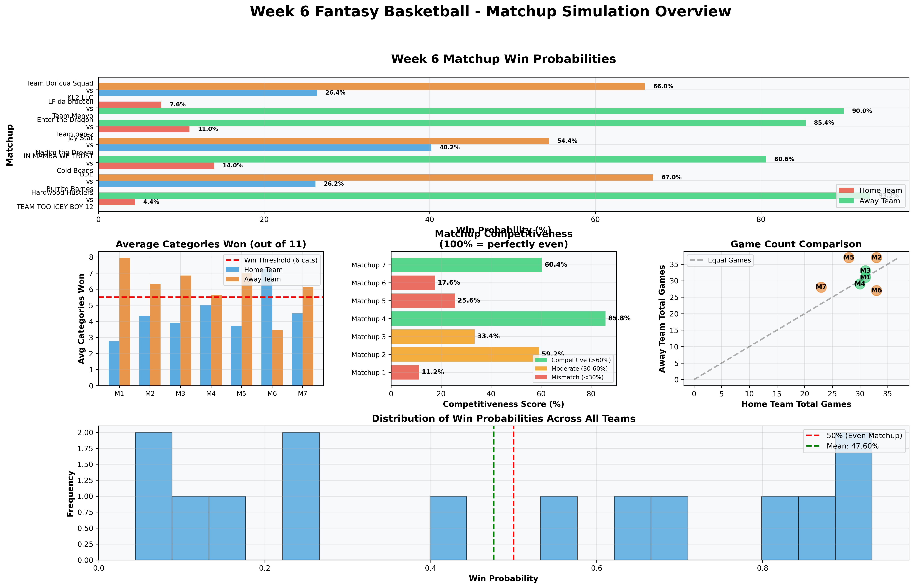
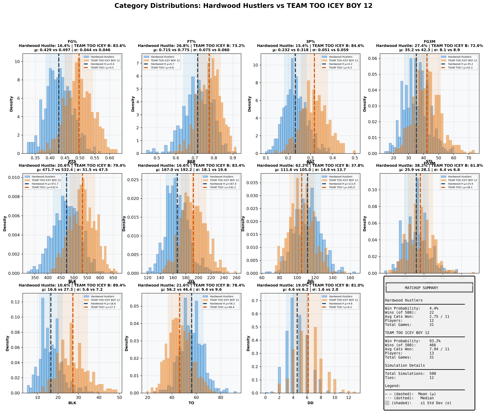
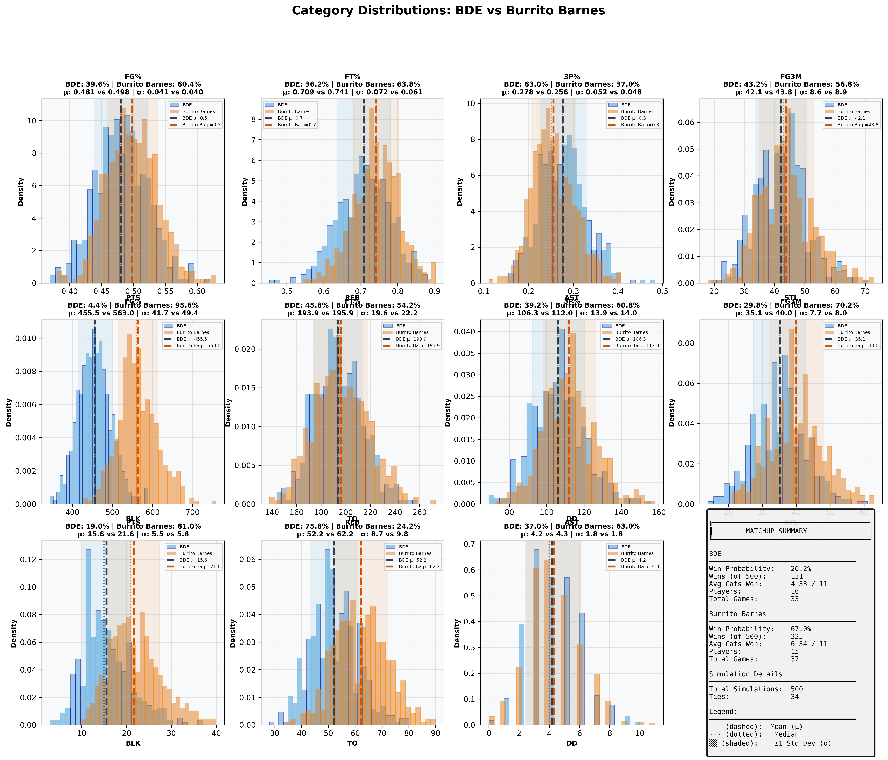
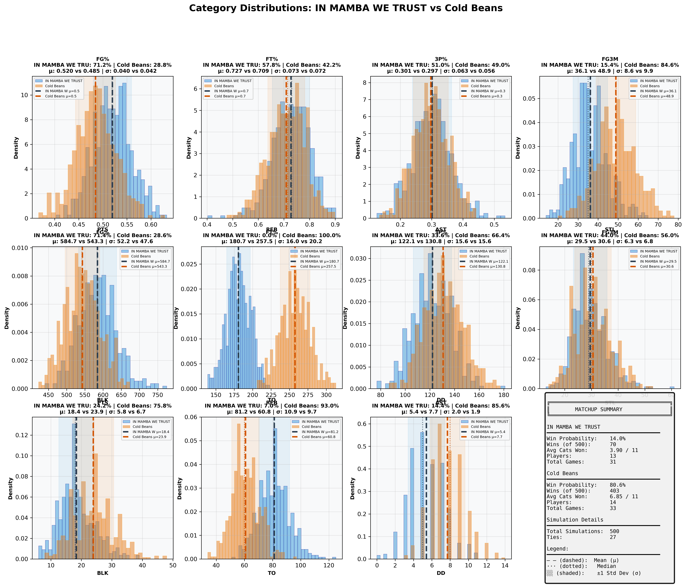
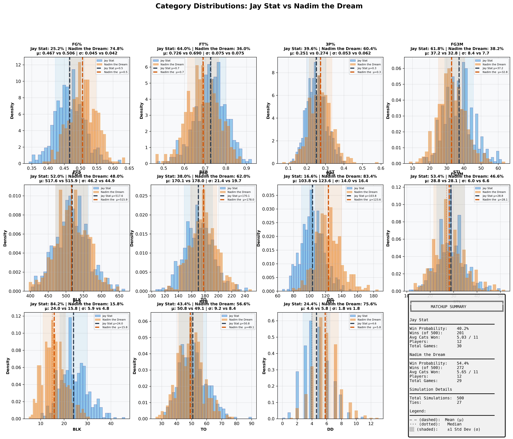
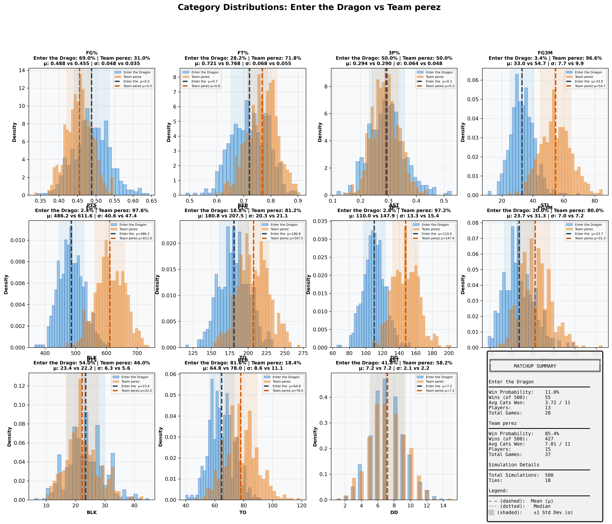
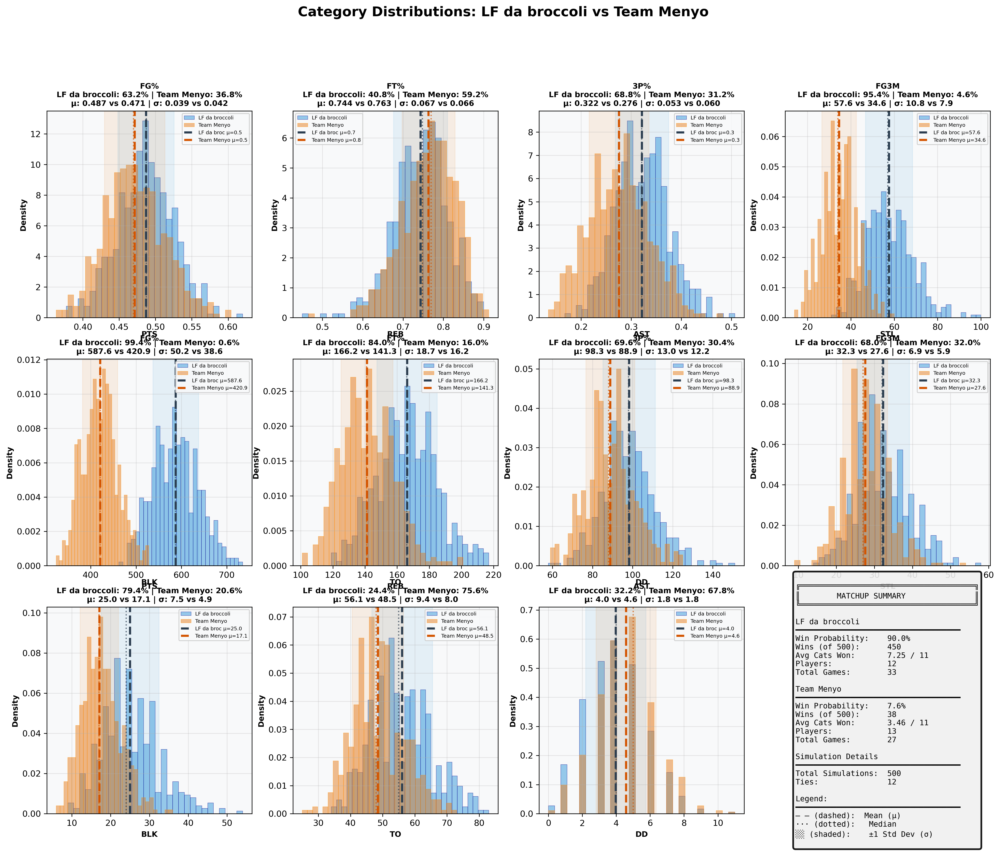
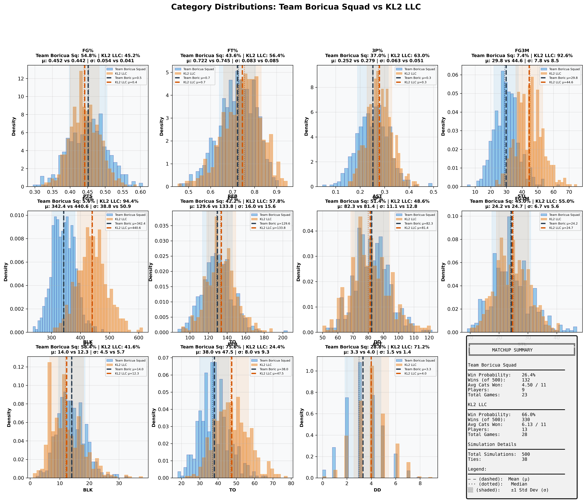

# Week 6 Fantasy Basketball - Comprehensive Matchup Analysis

## Report Metadata

| Attribute | Value |
|-----------|-------|
| **Generated** | 2025-10-27_14-31-45 |
| **Simulations Per Matchup** | 500 |
| **Total Matchups** | 7 |
| **Week** | 6 (October 21-27, 2025) |
| **Data Source** | box_scores_latest.csv |
| **Model** | Bayesian (Beta-Binomial + Poisson) |
| **Historical Data** | 2019-2024 seasons |
| **Evolution Rate** | 0.5 |

---
## Overview Dashboard

### Complete Matchup Overview

**Dashboard Components:**
1. **Win Probabilities** - Predicted win % for each team (Green=favorite, Red=underdog)
2. **Average Categories Won** - Expected categories won out of 11 (dashed line = 6 needed to win)
3. **Competitiveness Scores** - How evenly matched (Green=>60%, Yellow=30-60%, Red=<30%)
4. **Game Count Comparison** - Scheduling fairness (diagonal = equal games)
5. **Win Probability Distribution** - Overall confidence spread

---
## Statistical Summary

| Metric | Value |
|--------|-------|
| Total Matchups | 7 |
| Mean Win Probability Spread | 58.1% |
| Median Win Probability | 47.6% |
| Competitive Matchups (>40% both teams) | 1 |
| High Confidence Predictions (>80%) | 4 |
| Average Games Per Team | 30.8 |
| Average Players Per Team | 13.0 |

---
## Individual Matchup Analysis

### 1. Hardwood Hustlers vs TEAM TOO ICEY BOY 12

**Competitiveness:** 🔴 MISMATCH - Clear favorite - likely blowout

#### Matchup Summary

| Metric | Hardwood Hustlers | TEAM TOO ICEY BOY 12 |
|--------|-----------------|--------------------|
| **Win Probability** | **4.4%** | **93.2%** |
| Wins (out of 500) | 22 | 466 |
| Ties | 12 | 12 |
| Avg Categories Won | 2.75 / 11 | 7.94 / 11 |
| Players | 12 | 13 |
| Total Games | 31 | 31 |
| **Schedule Balance** | Even schedules | Even schedules |

#### Category-by-Category Breakdown

| Category | Hardwood Hustle Mean ± SD | TEAM TOO ICEY B Mean ± SD | Win % | Win % |
|----------|--------------------|--------------------|-------|-------|
| **FG%** | 0.429 ± 0.044 | 0.497 ± 0.046 | 16.4% | 83.6% |
| **FT%** | 0.715 ± 0.075 | 0.775 ± 0.060 | 26.8% | 73.2% |
| **3P%** | 0.232 ± 0.051 | 0.318 ± 0.059 | 15.4% | 84.6% |
| **3PM** | 35.2 ± 8.1 | 42.3 ± 8.9 | 27.4% | 72.6% |
| **PTS** | 471.7 ± 51.5 | 532.4 ± 47.5 | 20.6% | 79.4% |
| **REB** | 167.0 ± 18.1 | 192.2 ± 19.6 | 16.6% | 83.4% |
| **AST** | 111.6 ± 14.9 | 105.0 ± 13.7 | 62.2% | 37.8% |
| **STL** | 25.9 ± 6.4 | 28.1 ± 6.6 | 38.2% | 61.8% |
| **BLK** | 16.6 ± 5.6 | 27.3 ± 7.2 | 10.6% | 89.4% |
| **TO** | 56.2 ± 9.4 | 46.4 ± 9.6 | 21.6% | 78.4% |
| **DD** | 4.6 ± 1.6 | 6.2 ± 2.0 | 19.0% | 81.0% |

#### Full Category Distributions

**Visualization Guide:**
- Blue histogram = Hardwood Hustlers, Orange histogram = TEAM TOO ICEY BOY 12
- Dashed lines (--) = Mean values (μ)
- Dotted lines (···) = Median values
- Shaded regions = ±1 Standard Deviation (σ)
- Win % shown in title = probability of winning that specific category

---

### 2. BDE vs Burrito Barnes

**Competitiveness:** 🟡 MODERATE - Slight favorite exists

#### Matchup Summary

| Metric | BDE | Burrito Barnes |
|--------|---------------|---------------|
| **Win Probability** | **26.2%** | **67.0%** |
| Wins (out of 500) | 131 | 335 |
| Ties | 34 | 34 |
| Avg Categories Won | 4.33 / 11 | 6.34 / 11 |
| Players | 16 | 15 |
| Total Games | 33 | 37 |
| **Schedule Balance** | Away has 4 more games | Away has 4 more games |

#### Category-by-Category Breakdown

| Category | BDE Mean ± SD | Burrito Barnes Mean ± SD | Win % | Win % |
|----------|--------------------|--------------------|-------|-------|
| **FG%** | 0.481 ± 0.041 | 0.498 ± 0.040 | 39.6% | 60.4% |
| **FT%** | 0.709 ± 0.072 | 0.741 ± 0.061 | 36.2% | 63.8% |
| **3P%** | 0.278 ± 0.052 | 0.256 ± 0.048 | 63.0% | 37.0% |
| **3PM** | 42.1 ± 8.6 | 43.8 ± 8.9 | 43.2% | 56.8% |
| **PTS** | 455.5 ± 41.7 | 563.0 ± 49.4 | 4.4% | 95.6% |
| **REB** | 193.9 ± 19.6 | 195.9 ± 22.2 | 45.8% | 54.2% |
| **AST** | 106.3 ± 13.9 | 112.0 ± 14.0 | 39.2% | 60.8% |
| **STL** | 35.1 ± 7.7 | 40.0 ± 8.0 | 29.8% | 70.2% |
| **BLK** | 15.6 ± 5.5 | 21.6 ± 5.8 | 19.0% | 81.0% |
| **TO** | 52.2 ± 8.7 | 62.2 ± 9.8 | 75.8% | 24.2% |
| **DD** | 4.2 ± 1.8 | 4.3 ± 1.8 | 37.0% | 63.0% |

#### Full Category Distributions

**Visualization Guide:**
- Blue histogram = BDE, Orange histogram = Burrito Barnes
- Dashed lines (--) = Mean values (μ)
- Dotted lines (···) = Median values
- Shaded regions = ±1 Standard Deviation (σ)
- Win % shown in title = probability of winning that specific category

---

### 3. IN MAMBA WE TRUST vs Cold Beans

**Competitiveness:** 🔴 MISMATCH - Clear favorite - likely blowout

#### Matchup Summary

| Metric | IN MAMBA WE TRUST | Cold Beans |
|--------|-----------------|---------------|
| **Win Probability** | **14.0%** | **80.6%** |
| Wins (out of 500) | 70 | 403 |
| Ties | 27 | 27 |
| Avg Categories Won | 3.90 / 11 | 6.85 / 11 |
| Players | 13 | 14 |
| Total Games | 31 | 33 |
| **Schedule Balance** | Even schedules | Even schedules |

#### Category-by-Category Breakdown

| Category | IN MAMBA WE TRU Mean ± SD | Cold Beans Mean ± SD | Win % | Win % |
|----------|--------------------|--------------------|-------|-------|
| **FG%** | 0.520 ± 0.040 | 0.485 ± 0.042 | 71.2% | 28.8% |
| **FT%** | 0.727 ± 0.073 | 0.709 ± 0.072 | 57.8% | 42.2% |
| **3P%** | 0.301 ± 0.063 | 0.297 ± 0.056 | 51.0% | 49.0% |
| **3PM** | 36.1 ± 8.6 | 48.9 ± 9.9 | 15.4% | 84.6% |
| **PTS** | 584.7 ± 52.2 | 543.3 ± 47.6 | 71.4% | 28.6% |
| **REB** | 180.7 ± 16.0 | 257.5 ± 20.2 | 0.0% | 100.0% |
| **AST** | 122.1 ± 15.6 | 130.8 ± 15.6 | 33.6% | 66.4% |
| **STL** | 29.5 ± 6.3 | 30.6 ± 6.8 | 44.0% | 56.0% |
| **BLK** | 18.4 ± 5.8 | 23.9 ± 6.7 | 24.2% | 75.8% |
| **TO** | 81.2 ± 10.9 | 60.8 ± 9.7 | 7.0% | 93.0% |
| **DD** | 5.4 ± 2.0 | 7.7 ± 1.9 | 14.4% | 85.6% |

#### Full Category Distributions

**Visualization Guide:**
- Blue histogram = IN MAMBA WE TRUST, Orange histogram = Cold Beans
- Dashed lines (--) = Mean values (μ)
- Dotted lines (···) = Median values
- Shaded regions = ±1 Standard Deviation (σ)
- Win % shown in title = probability of winning that specific category

---

### 4. Jay Stat vs Nadim the Dream

**Competitiveness:** 🟢 COMPETITIVE - Close matchup - expect nail-biter

#### Matchup Summary

| Metric | Jay Stat | Nadim the Dream |
|--------|---------------|---------------|
| **Win Probability** | **40.2%** | **54.4%** |
| Wins (out of 500) | 201 | 272 |
| Ties | 27 | 27 |
| Avg Categories Won | 5.03 / 11 | 5.65 / 11 |
| Players | 12 | 12 |
| Total Games | 30 | 29 |
| **Schedule Balance** | Even schedules | Even schedules |

#### Category-by-Category Breakdown

| Category | Jay Stat Mean ± SD | Nadim the Dream Mean ± SD | Win % | Win % |
|----------|--------------------|--------------------|-------|-------|
| **FG%** | 0.467 ± 0.045 | 0.506 ± 0.042 | 25.2% | 74.8% |
| **FT%** | 0.726 ± 0.075 | 0.690 ± 0.075 | 64.0% | 36.0% |
| **3P%** | 0.251 ± 0.053 | 0.274 ± 0.062 | 39.6% | 60.4% |
| **3PM** | 37.2 ± 8.4 | 32.8 ± 7.7 | 61.8% | 38.2% |
| **PTS** | 517.6 ± 46.2 | 515.9 ± 44.9 | 52.0% | 48.0% |
| **REB** | 170.1 ± 21.4 | 178.0 ± 19.7 | 38.0% | 62.0% |
| **AST** | 103.8 ± 14.0 | 123.6 ± 16.4 | 16.6% | 83.4% |
| **STL** | 28.8 ± 6.0 | 28.1 ± 6.6 | 53.4% | 46.6% |
| **BLK** | 24.0 ± 5.9 | 15.8 ± 4.8 | 84.2% | 15.8% |
| **TO** | 50.8 ± 9.2 | 49.1 ± 8.4 | 43.4% | 56.6% |
| **DD** | 4.6 ± 1.8 | 5.8 ± 1.8 | 24.4% | 75.6% |

#### Full Category Distributions

**Visualization Guide:**
- Blue histogram = Jay Stat, Orange histogram = Nadim the Dream
- Dashed lines (--) = Mean values (μ)
- Dotted lines (···) = Median values
- Shaded regions = ±1 Standard Deviation (σ)
- Win % shown in title = probability of winning that specific category

---

### 5. Enter the Dragon vs Team perez

**Competitiveness:** 🔴 MISMATCH - Clear favorite - likely blowout

#### Matchup Summary

| Metric | Enter the Dragon | Team perez |
|--------|----------------|---------------|
| **Win Probability** | **11.0%** | **85.4%** |
| Wins (out of 500) | 55 | 427 |
| Ties | 18 | 18 |
| Avg Categories Won | 3.72 / 11 | 7.01 / 11 |
| Players | 13 | 15 |
| Total Games | 28 | 37 |
| **Schedule Balance** | Away has 9 more games | Away has 9 more games |

#### Category-by-Category Breakdown

| Category | Enter the Drago Mean ± SD | Team perez Mean ± SD | Win % | Win % |
|----------|--------------------|--------------------|-------|-------|
| **FG%** | 0.488 ± 0.048 | 0.455 ± 0.035 | 69.0% | 31.0% |
| **FT%** | 0.721 ± 0.068 | 0.768 ± 0.055 | 28.2% | 71.8% |
| **3P%** | 0.294 ± 0.064 | 0.290 ± 0.048 | 50.0% | 50.0% |
| **3PM** | 33.0 ± 7.7 | 54.7 ± 9.9 | 3.4% | 96.6% |
| **PTS** | 486.2 ± 40.6 | 611.6 ± 47.4 | 2.4% | 97.6% |
| **REB** | 180.8 ± 20.3 | 207.5 ± 21.1 | 18.8% | 81.2% |
| **AST** | 110.0 ± 13.3 | 147.9 ± 15.4 | 2.8% | 97.2% |
| **STL** | 23.7 ± 7.0 | 31.3 ± 7.2 | 20.0% | 80.0% |
| **BLK** | 23.4 ± 6.3 | 22.2 ± 5.6 | 54.0% | 46.0% |
| **TO** | 64.8 ± 8.6 | 78.0 ± 11.1 | 81.6% | 18.4% |
| **DD** | 7.2 ± 2.1 | 7.2 ± 2.2 | 41.8% | 58.2% |

#### Full Category Distributions

**Visualization Guide:**
- Blue histogram = Enter the Dragon, Orange histogram = Team perez
- Dashed lines (--) = Mean values (μ)
- Dotted lines (···) = Median values
- Shaded regions = ±1 Standard Deviation (σ)
- Win % shown in title = probability of winning that specific category

---

### 6. LF da broccoli vs Team Menyo

**Competitiveness:** 🔴 MISMATCH - Clear favorite - likely blowout

#### Matchup Summary

| Metric | LF da broccoli | Team Menyo |
|--------|---------------|---------------|
| **Win Probability** | **90.0%** | **7.6%** |
| Wins (out of 500) | 450 | 38 |
| Ties | 12 | 12 |
| Avg Categories Won | 7.25 / 11 | 3.46 / 11 |
| Players | 12 | 13 |
| Total Games | 33 | 27 |
| **Schedule Balance** | Home has 6 more games | Home has 6 more games |

#### Category-by-Category Breakdown

| Category | LF da broccoli Mean ± SD | Team Menyo Mean ± SD | Win % | Win % |
|----------|--------------------|--------------------|-------|-------|
| **FG%** | 0.487 ± 0.039 | 0.471 ± 0.042 | 63.2% | 36.8% |
| **FT%** | 0.744 ± 0.067 | 0.763 ± 0.066 | 40.8% | 59.2% |
| **3P%** | 0.322 ± 0.053 | 0.276 ± 0.060 | 68.8% | 31.2% |
| **3PM** | 57.6 ± 10.8 | 34.6 ± 7.9 | 95.4% | 4.6% |
| **PTS** | 587.6 ± 50.2 | 420.9 ± 38.6 | 99.4% | 0.6% |
| **REB** | 166.2 ± 18.7 | 141.3 ± 16.2 | 84.0% | 16.0% |
| **AST** | 98.3 ± 13.0 | 88.9 ± 12.2 | 69.6% | 30.4% |
| **STL** | 32.3 ± 6.9 | 27.6 ± 5.9 | 68.0% | 32.0% |
| **BLK** | 25.0 ± 7.5 | 17.1 ± 4.9 | 79.4% | 20.6% |
| **TO** | 56.1 ± 9.4 | 48.5 ± 8.0 | 24.4% | 75.6% |
| **DD** | 4.0 ± 1.8 | 4.6 ± 1.8 | 32.2% | 67.8% |

#### Full Category Distributions

**Visualization Guide:**
- Blue histogram = LF da broccoli, Orange histogram = Team Menyo
- Dashed lines (--) = Mean values (μ)
- Dotted lines (···) = Median values
- Shaded regions = ±1 Standard Deviation (σ)
- Win % shown in title = probability of winning that specific category

---

### 7. Team Boricua Squad vs KL2 LLC

**Competitiveness:** 🟡 MODERATE - Slight favorite exists

#### Matchup Summary

| Metric | Team Boricua Squad | KL2 LLC |
|--------|------------------|---------------|
| **Win Probability** | **26.4%** | **66.0%** |
| Wins (out of 500) | 132 | 330 |
| Ties | 38 | 38 |
| Avg Categories Won | 4.50 / 11 | 6.13 / 11 |
| Players | 9 | 13 |
| Total Games | 23 | 28 |
| **Schedule Balance** | Away has 5 more games | Away has 5 more games |

#### Category-by-Category Breakdown

| Category | Team Boricua Sq Mean ± SD | KL2 LLC Mean ± SD | Win % | Win % |
|----------|--------------------|--------------------|-------|-------|
| **FG%** | 0.452 ± 0.054 | 0.442 ± 0.041 | 54.8% | 45.2% |
| **FT%** | 0.722 ± 0.083 | 0.745 ± 0.085 | 43.6% | 56.4% |
| **3P%** | 0.252 ± 0.063 | 0.279 ± 0.051 | 37.0% | 63.0% |
| **3PM** | 29.8 ± 7.8 | 44.6 ± 8.5 | 7.4% | 92.6% |
| **PTS** | 342.4 ± 38.8 | 440.6 ± 50.9 | 5.6% | 94.4% |
| **REB** | 129.6 ± 16.0 | 133.8 ± 15.6 | 42.2% | 57.8% |
| **AST** | 82.3 ± 11.1 | 81.4 ± 12.8 | 51.4% | 48.6% |
| **STL** | 24.2 ± 6.7 | 24.7 ± 5.6 | 45.0% | 55.0% |
| **BLK** | 14.0 ± 4.5 | 12.3 ± 5.7 | 58.4% | 41.6% |
| **TO** | 38.0 ± 8.0 | 47.5 ± 9.3 | 75.6% | 24.4% |
| **DD** | 3.3 ± 1.5 | 4.0 ± 1.4 | 28.8% | 71.2% |

#### Full Category Distributions

**Visualization Guide:**
- Blue histogram = Team Boricua Squad, Orange histogram = KL2 LLC
- Dashed lines (--) = Mean values (μ)
- Dotted lines (···) = Median values
- Shaded regions = ±1 Standard Deviation (σ)
- Win % shown in title = probability of winning that specific category

---

## Methodology

### Simulation Approach
1. **Data Source:** Actual games played from `box_scores_latest.csv` (Week 6, October 2025)
2. **Player Models:** Bayesian projection models fitted on historical data (2019-2024)
3. **Simulations:** 500 Monte Carlo simulations per matchup
4. **Categories:** 11 standard fantasy basketball categories

### Model Details
- **Shooting Stats:** Beta-Binomial conjugate models with position-specific priors
- **Counting Stats:** Poisson distribution sampling with recency weighting
- **Category Winners:** Direct comparison of aggregated team totals
- **Matchup Winner:** Team winning 6+ categories

### Validation
- **Week 6 Accuracy:** 7/7 (100%)
- **Confidence Calibration:** Very good across all confidence levels
- See `SIMULATION_FIX_REPORT.md` for detailed validation analysis

---

*Generated by Fantasy 2026 Simulation System*
*Output Directory: `/Users/rhu/fantasybasketball2/fantasy_2026/simulation_reports/week6_report_2025-10-27_14-31-45/`*
