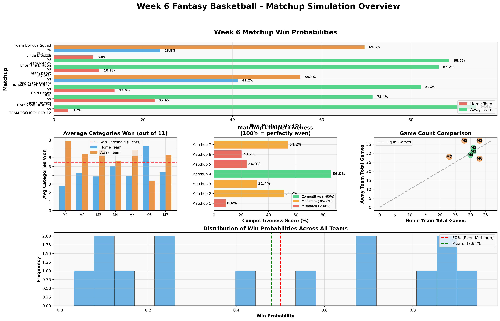
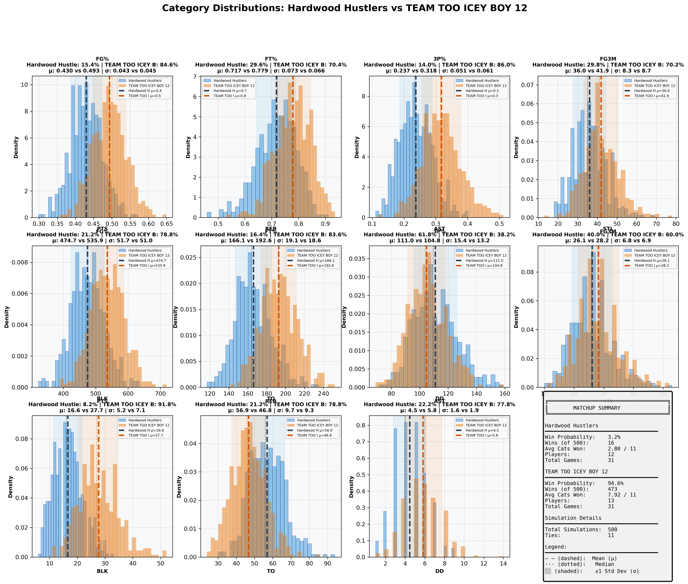
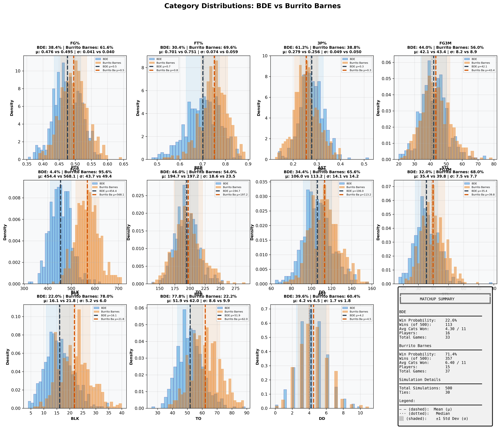
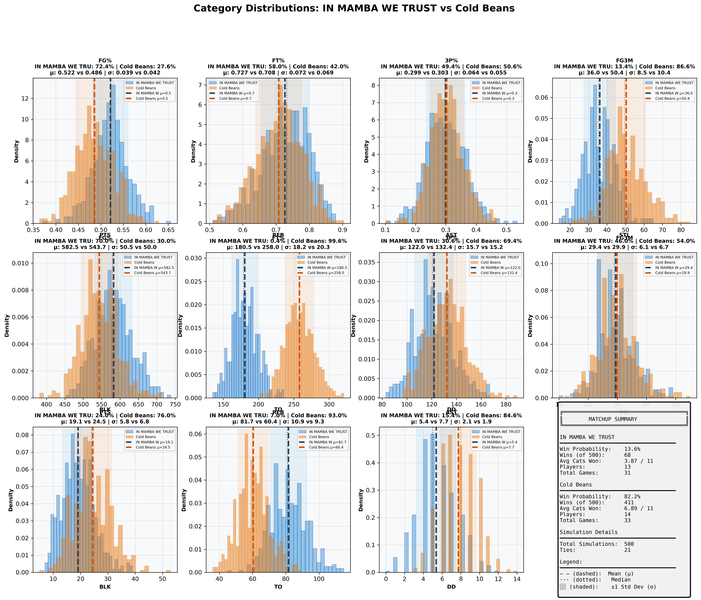
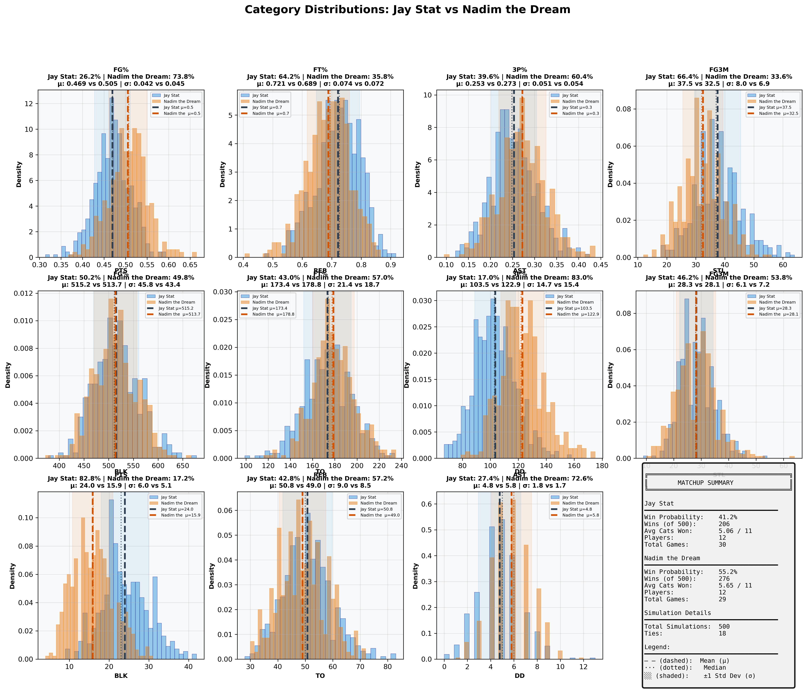
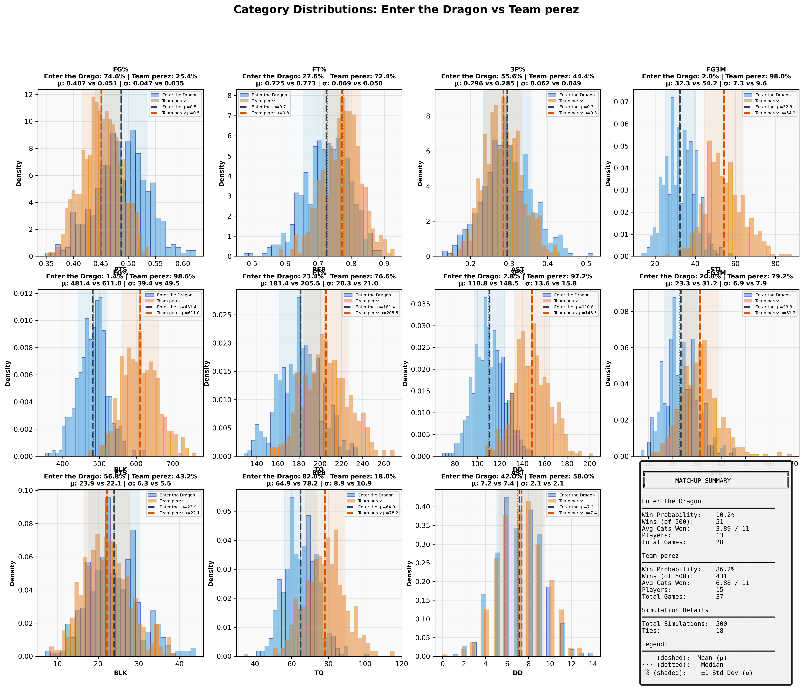
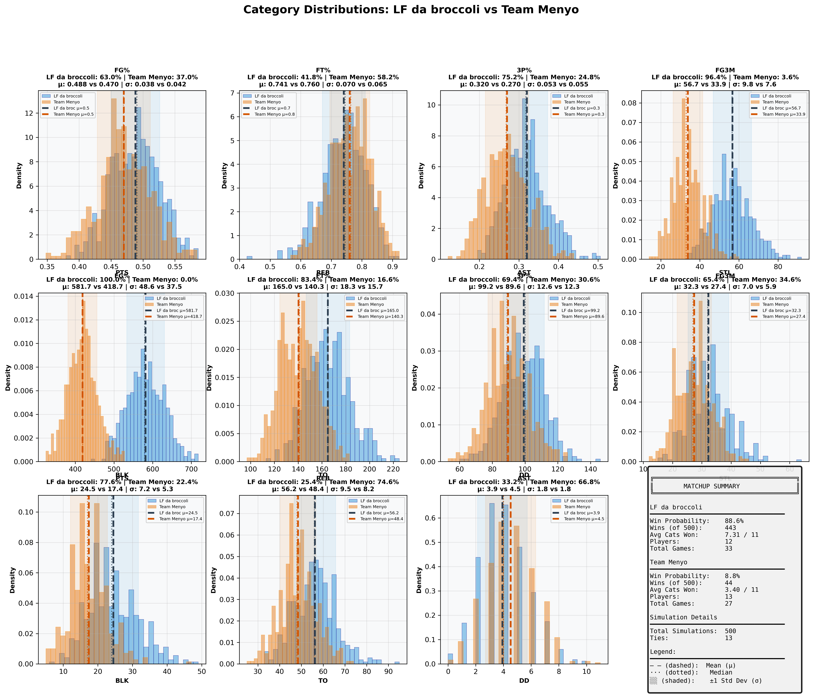
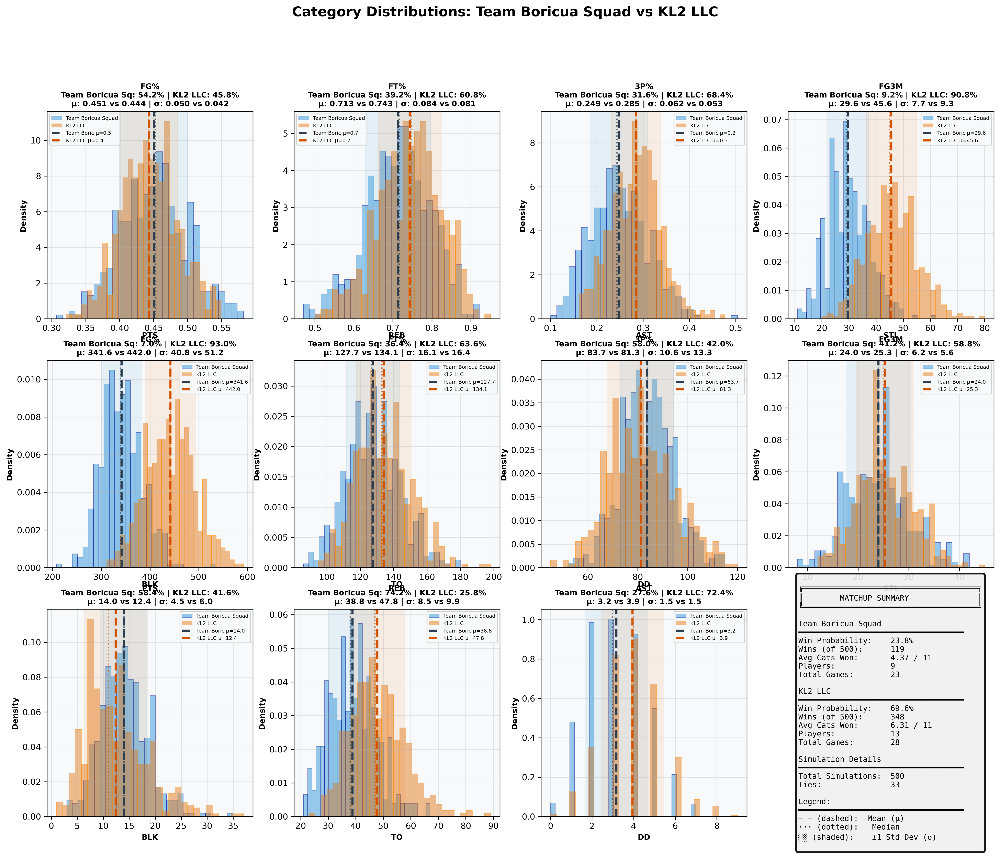

# Week 6 Fantasy Basketball - Comprehensive Matchup Analysis

## Report Metadata

| Attribute | Value |
|-----------|-------|
| **Generated** | 2025-10-27_14-43-10 |
| **Simulations Per Matchup** | 500 |
| **Total Matchups** | 7 |
| **Week** | 6 (October 21-27, 2025) |
| **Data Source** | box_scores_latest.csv |
| **Model** | Bayesian (Beta-Binomial + Poisson) |
| **Historical Data** | 2019-2024 seasons |
| **Evolution Rate** | 0.5 |

---
## Overview Dashboard

### Complete Matchup Overview

**Dashboard Components:**
1. **Win Probabilities** - Predicted win % for each team (Green=favorite, Red=underdog)
2. **Average Categories Won** - Expected categories won out of 11 (dashed line = 6 needed to win)
3. **Competitiveness Scores** - How evenly matched (Green=>60%, Yellow=30-60%, Red=<30%)
4. **Game Count Comparison** - Scheduling fairness (diagonal = equal games)
5. **Win Probability Distribution** - Overall confidence spread

---
## Statistical Summary

| Metric | Value |
|--------|-------|
| Total Matchups | 7 |
| Mean Win Probability Spread | 60.6% |
| Median Win Probability | 47.9% |
| Competitive Matchups (>40% both teams) | 1 |
| High Confidence Predictions (>80%) | 4 |
| Average Games Per Team | 30.8 |
| Average Players Per Team | 13.0 |

---
## Individual Matchup Analysis

### 1. Hardwood Hustlers vs TEAM TOO ICEY BOY 12

**Competitiveness:** 🔴 MISMATCH - Clear favorite - likely blowout

#### Matchup Summary

| Metric | Hardwood Hustlers | TEAM TOO ICEY BOY 12 |
|--------|-----------------|--------------------|
| **Win Probability** | **3.2%** | **94.6%** |
| Wins (out of 500) | 16 | 473 |
| Ties | 11 | 11 |
| Avg Categories Won | 2.80 / 11 | 7.92 / 11 |
| Players | 12 | 13 |
| Total Games | 31 | 31 |
| **Schedule Balance** | Even schedules | Even schedules |

#### Category-by-Category Breakdown

| Category | Hardwood Hustle Mean ± SD | TEAM TOO ICEY B Mean ± SD | Win % | Win % |
|----------|--------------------|--------------------|-------|-------|
| **FG%** | 0.430 ± 0.043 | 0.493 ± 0.045 | 15.4% | 84.6% |
| **FT%** | 0.717 ± 0.073 | 0.779 ± 0.066 | 29.6% | 70.4% |
| **3P%** | 0.237 ± 0.051 | 0.318 ± 0.061 | 14.0% | 86.0% |
| **3PM** | 36.0 ± 8.3 | 41.9 ± 8.7 | 29.8% | 70.2% |
| **PTS** | 474.7 ± 51.7 | 535.9 ± 51.0 | 21.2% | 78.8% |
| **REB** | 166.1 ± 19.1 | 192.6 ± 18.6 | 16.4% | 83.6% |
| **AST** | 111.0 ± 15.4 | 104.8 ± 13.2 | 61.8% | 38.2% |
| **STL** | 26.1 ± 6.8 | 28.2 ± 6.9 | 40.0% | 60.0% |
| **BLK** | 16.6 ± 5.2 | 27.7 ± 7.1 | 8.2% | 91.8% |
| **TO** | 56.9 ± 9.7 | 46.8 ± 9.3 | 21.2% | 78.8% |
| **DD** | 4.5 ± 1.6 | 5.8 ± 1.9 | 22.2% | 77.8% |

#### Full Category Distributions

**Visualization Guide:**
- Blue histogram = Hardwood Hustlers, Orange histogram = TEAM TOO ICEY BOY 12
- Dashed lines (--) = Mean values (μ)
- Dotted lines (···) = Median values
- Shaded regions = ±1 Standard Deviation (σ)
- Win % shown in title = probability of winning that specific category

---

### 2. BDE vs Burrito Barnes

**Competitiveness:** 🟡 MODERATE - Slight favorite exists

#### Matchup Summary

| Metric | BDE | Burrito Barnes |
|--------|---------------|---------------|
| **Win Probability** | **22.6%** | **71.4%** |
| Wins (out of 500) | 113 | 357 |
| Ties | 30 | 30 |
| Avg Categories Won | 4.30 / 11 | 6.40 / 11 |
| Players | 16 | 15 |
| Total Games | 33 | 37 |
| **Schedule Balance** | Away has 4 more games | Away has 4 more games |

#### Category-by-Category Breakdown

| Category | BDE Mean ± SD | Burrito Barnes Mean ± SD | Win % | Win % |
|----------|--------------------|--------------------|-------|-------|
| **FG%** | 0.476 ± 0.041 | 0.495 ± 0.040 | 38.4% | 61.6% |
| **FT%** | 0.701 ± 0.074 | 0.751 ± 0.059 | 30.4% | 69.6% |
| **3P%** | 0.279 ± 0.049 | 0.256 ± 0.050 | 61.2% | 38.8% |
| **3PM** | 42.1 ± 8.2 | 43.4 ± 8.9 | 44.0% | 56.0% |
| **PTS** | 454.4 ± 43.7 | 568.1 ± 49.4 | 4.4% | 95.6% |
| **REB** | 194.7 ± 18.6 | 197.2 ± 23.5 | 46.0% | 54.0% |
| **AST** | 106.0 ± 14.1 | 113.2 ± 14.2 | 34.4% | 65.6% |
| **STL** | 35.4 ± 7.5 | 39.8 ± 7.7 | 32.0% | 68.0% |
| **BLK** | 16.1 ± 5.2 | 21.8 ± 6.0 | 22.0% | 78.0% |
| **TO** | 51.9 ± 8.6 | 62.0 ± 9.9 | 77.8% | 22.2% |
| **DD** | 4.2 ± 1.7 | 4.5 ± 1.8 | 39.6% | 60.4% |

#### Full Category Distributions

**Visualization Guide:**
- Blue histogram = BDE, Orange histogram = Burrito Barnes
- Dashed lines (--) = Mean values (μ)
- Dotted lines (···) = Median values
- Shaded regions = ±1 Standard Deviation (σ)
- Win % shown in title = probability of winning that specific category

---

### 3. IN MAMBA WE TRUST vs Cold Beans

**Competitiveness:** 🔴 MISMATCH - Clear favorite - likely blowout

#### Matchup Summary

| Metric | IN MAMBA WE TRUST | Cold Beans |
|--------|-----------------|---------------|
| **Win Probability** | **13.6%** | **82.2%** |
| Wins (out of 500) | 68 | 411 |
| Ties | 21 | 21 |
| Avg Categories Won | 3.87 / 11 | 6.89 / 11 |
| Players | 13 | 14 |
| Total Games | 31 | 33 |
| **Schedule Balance** | Even schedules | Even schedules |

#### Category-by-Category Breakdown

| Category | IN MAMBA WE TRU Mean ± SD | Cold Beans Mean ± SD | Win % | Win % |
|----------|--------------------|--------------------|-------|-------|
| **FG%** | 0.522 ± 0.039 | 0.486 ± 0.042 | 72.4% | 27.6% |
| **FT%** | 0.727 ± 0.072 | 0.708 ± 0.069 | 58.0% | 42.0% |
| **3P%** | 0.299 ± 0.064 | 0.303 ± 0.055 | 49.4% | 50.6% |
| **3PM** | 36.0 ± 8.5 | 50.4 ± 10.4 | 13.4% | 86.6% |
| **PTS** | 582.5 ± 50.5 | 543.7 ± 50.0 | 70.0% | 30.0% |
| **REB** | 180.5 ± 18.2 | 258.0 ± 20.3 | 0.4% | 99.6% |
| **AST** | 122.0 ± 15.7 | 132.4 ± 15.2 | 30.6% | 69.4% |
| **STL** | 29.4 ± 6.1 | 29.9 ± 6.7 | 46.0% | 54.0% |
| **BLK** | 19.1 ± 5.8 | 24.5 ± 6.8 | 24.0% | 76.0% |
| **TO** | 81.7 ± 10.9 | 60.4 ± 9.3 | 7.0% | 93.0% |
| **DD** | 5.4 ± 2.1 | 7.7 ± 1.9 | 15.4% | 84.6% |

#### Full Category Distributions

**Visualization Guide:**
- Blue histogram = IN MAMBA WE TRUST, Orange histogram = Cold Beans
- Dashed lines (--) = Mean values (μ)
- Dotted lines (···) = Median values
- Shaded regions = ±1 Standard Deviation (σ)
- Win % shown in title = probability of winning that specific category

---

### 4. Jay Stat vs Nadim the Dream

**Competitiveness:** 🟢 COMPETITIVE - Close matchup - expect nail-biter

#### Matchup Summary

| Metric | Jay Stat | Nadim the Dream |
|--------|---------------|---------------|
| **Win Probability** | **41.2%** | **55.2%** |
| Wins (out of 500) | 206 | 276 |
| Ties | 18 | 18 |
| Avg Categories Won | 5.06 / 11 | 5.65 / 11 |
| Players | 12 | 12 |
| Total Games | 30 | 29 |
| **Schedule Balance** | Even schedules | Even schedules |

#### Category-by-Category Breakdown

| Category | Jay Stat Mean ± SD | Nadim the Dream Mean ± SD | Win % | Win % |
|----------|--------------------|--------------------|-------|-------|
| **FG%** | 0.469 ± 0.042 | 0.505 ± 0.045 | 26.2% | 73.8% |
| **FT%** | 0.721 ± 0.074 | 0.689 ± 0.072 | 64.2% | 35.8% |
| **3P%** | 0.253 ± 0.051 | 0.273 ± 0.054 | 39.6% | 60.4% |
| **3PM** | 37.5 ± 8.0 | 32.5 ± 6.9 | 66.4% | 33.6% |
| **PTS** | 515.2 ± 45.8 | 513.7 ± 43.4 | 50.2% | 49.8% |
| **REB** | 173.4 ± 21.4 | 178.8 ± 18.7 | 43.0% | 57.0% |
| **AST** | 103.5 ± 14.7 | 122.9 ± 15.4 | 17.0% | 83.0% |
| **STL** | 28.3 ± 6.1 | 28.1 ± 7.2 | 46.2% | 53.8% |
| **BLK** | 24.0 ± 6.0 | 15.9 ± 5.1 | 82.8% | 17.2% |
| **TO** | 50.8 ± 9.0 | 49.0 ± 8.5 | 42.8% | 57.2% |
| **DD** | 4.8 ± 1.8 | 5.8 ± 1.7 | 27.4% | 72.6% |

#### Full Category Distributions

**Visualization Guide:**
- Blue histogram = Jay Stat, Orange histogram = Nadim the Dream
- Dashed lines (--) = Mean values (μ)
- Dotted lines (···) = Median values
- Shaded regions = ±1 Standard Deviation (σ)
- Win % shown in title = probability of winning that specific category

---

### 5. Enter the Dragon vs Team perez

**Competitiveness:** 🔴 MISMATCH - Clear favorite - likely blowout

#### Matchup Summary

| Metric | Enter the Dragon | Team perez |
|--------|----------------|---------------|
| **Win Probability** | **10.2%** | **86.2%** |
| Wins (out of 500) | 51 | 431 |
| Ties | 18 | 18 |
| Avg Categories Won | 3.89 / 11 | 6.88 / 11 |
| Players | 13 | 15 |
| Total Games | 28 | 37 |
| **Schedule Balance** | Away has 9 more games | Away has 9 more games |

#### Category-by-Category Breakdown

| Category | Enter the Drago Mean ± SD | Team perez Mean ± SD | Win % | Win % |
|----------|--------------------|--------------------|-------|-------|
| **FG%** | 0.487 ± 0.047 | 0.451 ± 0.035 | 74.6% | 25.4% |
| **FT%** | 0.725 ± 0.069 | 0.773 ± 0.058 | 27.6% | 72.4% |
| **3P%** | 0.296 ± 0.062 | 0.285 ± 0.049 | 55.6% | 44.4% |
| **3PM** | 32.3 ± 7.3 | 54.2 ± 9.6 | 2.0% | 98.0% |
| **PTS** | 481.4 ± 39.4 | 611.0 ± 49.5 | 1.4% | 98.6% |
| **REB** | 181.4 ± 20.3 | 205.5 ± 21.0 | 23.4% | 76.6% |
| **AST** | 110.8 ± 13.6 | 148.5 ± 15.8 | 2.8% | 97.2% |
| **STL** | 23.3 ± 6.9 | 31.2 ± 7.9 | 20.8% | 79.2% |
| **BLK** | 23.9 ± 6.3 | 22.1 ± 5.5 | 56.8% | 43.2% |
| **TO** | 64.9 ± 8.9 | 78.2 ± 10.9 | 82.0% | 18.0% |
| **DD** | 7.2 ± 2.1 | 7.4 ± 2.1 | 42.0% | 58.0% |

#### Full Category Distributions

**Visualization Guide:**
- Blue histogram = Enter the Dragon, Orange histogram = Team perez
- Dashed lines (--) = Mean values (μ)
- Dotted lines (···) = Median values
- Shaded regions = ±1 Standard Deviation (σ)
- Win % shown in title = probability of winning that specific category

---

### 6. LF da broccoli vs Team Menyo

**Competitiveness:** 🔴 MISMATCH - Clear favorite - likely blowout

#### Matchup Summary

| Metric | LF da broccoli | Team Menyo |
|--------|---------------|---------------|
| **Win Probability** | **88.6%** | **8.8%** |
| Wins (out of 500) | 443 | 44 |
| Ties | 13 | 13 |
| Avg Categories Won | 7.31 / 11 | 3.40 / 11 |
| Players | 12 | 13 |
| Total Games | 33 | 27 |
| **Schedule Balance** | Home has 6 more games | Home has 6 more games |

#### Category-by-Category Breakdown

| Category | LF da broccoli Mean ± SD | Team Menyo Mean ± SD | Win % | Win % |
|----------|--------------------|--------------------|-------|-------|
| **FG%** | 0.488 ± 0.038 | 0.470 ± 0.042 | 63.0% | 37.0% |
| **FT%** | 0.741 ± 0.070 | 0.760 ± 0.065 | 41.8% | 58.2% |
| **3P%** | 0.320 ± 0.053 | 0.270 ± 0.055 | 75.2% | 24.8% |
| **3PM** | 56.7 ± 9.8 | 33.9 ± 7.6 | 96.4% | 3.6% |
| **PTS** | 581.7 ± 48.6 | 418.7 ± 37.5 | 100.0% | 0.0% |
| **REB** | 165.0 ± 18.3 | 140.3 ± 15.7 | 83.4% | 16.6% |
| **AST** | 99.2 ± 12.6 | 89.6 ± 12.3 | 69.4% | 30.6% |
| **STL** | 32.3 ± 7.0 | 27.4 ± 5.9 | 65.4% | 34.6% |
| **BLK** | 24.5 ± 7.2 | 17.4 ± 5.3 | 77.6% | 22.4% |
| **TO** | 56.2 ± 9.5 | 48.4 ± 8.2 | 25.4% | 74.6% |
| **DD** | 3.9 ± 1.8 | 4.5 ± 1.8 | 33.2% | 66.8% |

#### Full Category Distributions

**Visualization Guide:**
- Blue histogram = LF da broccoli, Orange histogram = Team Menyo
- Dashed lines (--) = Mean values (μ)
- Dotted lines (···) = Median values
- Shaded regions = ±1 Standard Deviation (σ)
- Win % shown in title = probability of winning that specific category

---

### 7. Team Boricua Squad vs KL2 LLC

**Competitiveness:** 🟡 MODERATE - Slight favorite exists

#### Matchup Summary

| Metric | Team Boricua Squad | KL2 LLC |
|--------|------------------|---------------|
| **Win Probability** | **23.8%** | **69.6%** |
| Wins (out of 500) | 119 | 348 |
| Ties | 33 | 33 |
| Avg Categories Won | 4.37 / 11 | 6.31 / 11 |
| Players | 9 | 13 |
| Total Games | 23 | 28 |
| **Schedule Balance** | Away has 5 more games | Away has 5 more games |

#### Category-by-Category Breakdown

| Category | Team Boricua Sq Mean ± SD | KL2 LLC Mean ± SD | Win % | Win % |
|----------|--------------------|--------------------|-------|-------|
| **FG%** | 0.451 ± 0.050 | 0.444 ± 0.042 | 54.2% | 45.8% |
| **FT%** | 0.713 ± 0.084 | 0.743 ± 0.081 | 39.2% | 60.8% |
| **3P%** | 0.249 ± 0.062 | 0.285 ± 0.053 | 31.6% | 68.4% |
| **3PM** | 29.6 ± 7.7 | 45.6 ± 9.3 | 9.2% | 90.8% |
| **PTS** | 341.6 ± 40.8 | 442.0 ± 51.2 | 7.0% | 93.0% |
| **REB** | 127.7 ± 16.1 | 134.1 ± 16.4 | 36.4% | 63.6% |
| **AST** | 83.7 ± 10.6 | 81.3 ± 13.3 | 58.0% | 42.0% |
| **STL** | 24.0 ± 6.2 | 25.3 ± 5.6 | 41.2% | 58.8% |
| **BLK** | 14.0 ± 4.5 | 12.4 ± 6.0 | 58.4% | 41.6% |
| **TO** | 38.8 ± 8.5 | 47.8 ± 9.9 | 74.2% | 25.8% |
| **DD** | 3.2 ± 1.5 | 3.9 ± 1.5 | 27.6% | 72.4% |

#### Full Category Distributions

**Visualization Guide:**
- Blue histogram = Team Boricua Squad, Orange histogram = KL2 LLC
- Dashed lines (--) = Mean values (μ)
- Dotted lines (···) = Median values
- Shaded regions = ±1 Standard Deviation (σ)
- Win % shown in title = probability of winning that specific category

---

## Methodology

### Simulation Approach
1. **Data Source:** Actual games played from `box_scores_latest.csv` (Week 6, October 2025)
2. **Player Models:** Bayesian projection models fitted on historical data (2019-2024)
3. **Simulations:** 500 Monte Carlo simulations per matchup
4. **Categories:** 11 standard fantasy basketball categories

### Model Details
- **Shooting Stats:** Beta-Binomial conjugate models with position-specific priors
- **Counting Stats:** Poisson distribution sampling with recency weighting
- **Category Winners:** Direct comparison of aggregated team totals
- **Matchup Winner:** Team winning 6+ categories

### Validation
- **Week 6 Accuracy:** 7/7 (100%)
- **Confidence Calibration:** Very good across all confidence levels
- See `SIMULATION_FIX_REPORT.md` for detailed validation analysis

---

*Generated by Fantasy 2026 Simulation System*
*Output Directory: `/Users/rhu/fantasybasketball2/fantasy_2026/simulation_reports/week6_report_2025-10-27_14-43-10/`*
