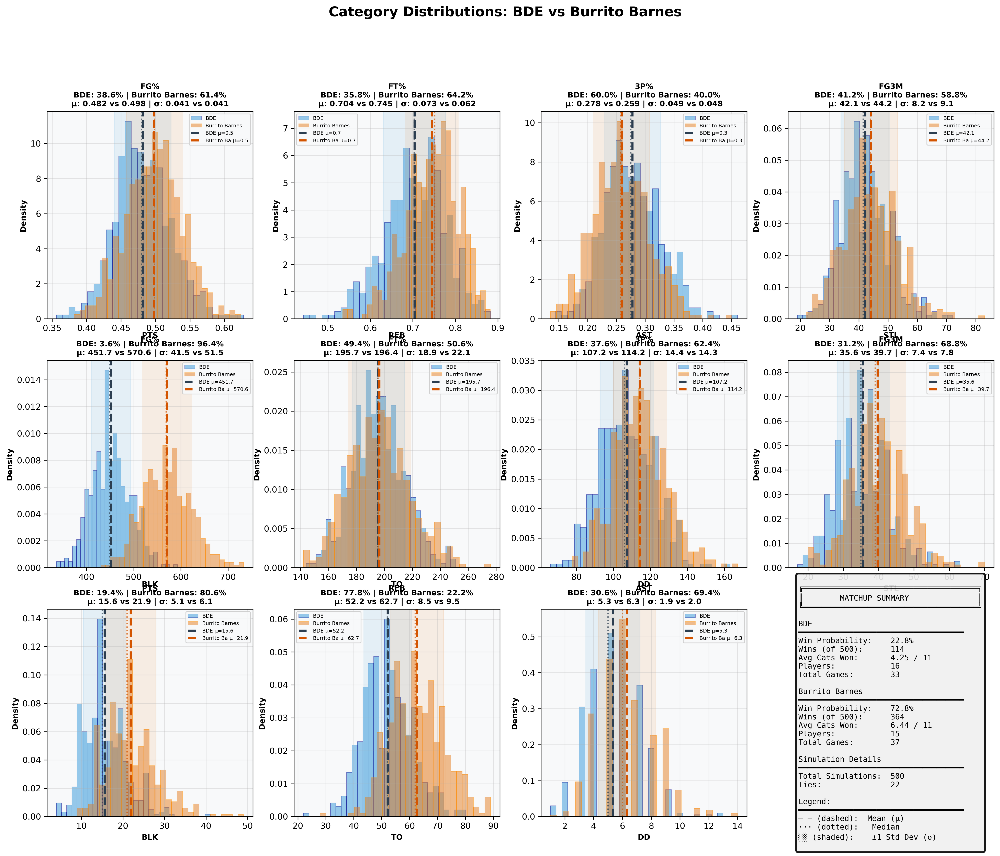

# Week 6 Fantasy Basketball - Comprehensive Matchup Analysis

## Report Metadata

| Attribute | Value |
|-----------|-------|
| **Generated** | 2025-10-27_15-03-10 |
| **Simulations Per Matchup** | 500 |
| **Total Matchups** | 7 |
| **Week** | 6 (October 21-27, 2025) |
| **Data Source** | box_scores_latest.csv |
| **Model** | Bayesian (Beta-Binomial + Poisson) |
| **Historical Data** | 2019-2024 seasons |
| **Evolution Rate** | 0.5 |

---
## Overview Dashboard

### Complete Matchup Overview

**Dashboard Components:**
1. **Win Probabilities** - Predicted win % for each team (Green=favorite, Red=underdog)
2. **Average Categories Won** - Expected categories won out of 11 (dashed line = 6 needed to win)
3. **Competitiveness Scores** - How evenly matched (Green=>60%, Yellow=30-60%, Red=<30%)
4. **Game Count Comparison** - Scheduling fairness (diagonal = equal games)
5. **Win Probability Distribution** - Overall confidence spread

---
## Statistical Summary

| Metric | Value |
|--------|-------|
| Total Matchups | 7 |
| Mean Win Probability Spread | 63.0% |
| Median Win Probability | 48.2% |
| Competitive Matchups (>40% both teams) | 0 |
| High Confidence Predictions (>80%) | 4 |
| Average Games Per Team | 30.8 |
| Average Players Per Team | 13.0 |

---
## Individual Matchup Analysis

### 1. Hardwood Hustlers vs TEAM TOO ICEY BOY 12

**Competitiveness:** 🔴 MISMATCH - Clear favorite - likely blowout

#### Matchup Summary

| Metric | Hardwood Hustlers | TEAM TOO ICEY BOY 12 |
|--------|-----------------|--------------------|
| **Win Probability** | **1.8%** | **97.2%** |
| Wins (out of 500) | 9 | 486 |
| Ties | 5 | 5 |
| Avg Categories Won | 2.64 / 11 | 8.05 / 11 |
| Players | 12 | 13 |
| Total Games | 31 | 31 |
| **Schedule Balance** | Even schedules | Even schedules |

#### Category-by-Category Breakdown

| Category | Hardwood Hustle Mean ± SD | TEAM TOO ICEY B Mean ± SD | Win % | Win % |
|----------|--------------------|--------------------|-------|-------|
| **FG%** | 0.425 ± 0.042 | 0.498 ± 0.045 | 12.4% | 87.6% |
| **FT%** | 0.713 ± 0.070 | 0.778 ± 0.064 | 23.4% | 76.6% |
| **3P%** | 0.230 ± 0.053 | 0.322 ± 0.062 | 13.0% | 87.0% |
| **3PM** | 35.1 ± 8.5 | 42.4 ± 8.7 | 28.6% | 71.4% |
| **PTS** | 473.2 ± 51.9 | 534.6 ± 47.8 | 18.0% | 82.0% |
| **REB** | 165.0 ± 18.3 | 192.2 ± 19.6 | 13.2% | 86.8% |
| **AST** | 111.2 ± 14.7 | 105.3 ± 13.4 | 60.2% | 39.8% |
| **STL** | 26.2 ± 6.5 | 28.3 ± 7.0 | 40.0% | 60.0% |
| **BLK** | 16.8 ± 5.3 | 27.9 ± 7.2 | 9.6% | 90.4% |
| **TO** | 55.8 ± 10.0 | 46.4 ± 9.1 | 21.2% | 78.8% |
| **DD** | 6.1 ± 1.8 | 7.8 ± 2.2 | 24.0% | 76.0% |

#### Full Category Distributions

**Visualization Guide:**
- Blue histogram = Hardwood Hustlers, Orange histogram = TEAM TOO ICEY BOY 12
- Dashed lines (--) = Mean values (μ)
- Dotted lines (···) = Median values
- Shaded regions = ±1 Standard Deviation (σ)
- Win % shown in title = probability of winning that specific category

---

### 2. BDE vs Burrito Barnes

**Competitiveness:** 🔴 MISMATCH - Clear favorite - likely blowout

#### Matchup Summary

| Metric | BDE | Burrito Barnes |
|--------|---------------|---------------|
| **Win Probability** | **22.8%** | **72.8%** |
| Wins (out of 500) | 114 | 364 |
| Ties | 22 | 22 |
| Avg Categories Won | 4.25 / 11 | 6.44 / 11 |
| Players | 16 | 15 |
| Total Games | 33 | 37 |
| **Schedule Balance** | Away has 4 more games | Away has 4 more games |

#### Category-by-Category Breakdown

| Category | BDE Mean ± SD | Burrito Barnes Mean ± SD | Win % | Win % |
|----------|--------------------|--------------------|-------|-------|
| **FG%** | 0.482 ± 0.041 | 0.498 ± 0.041 | 38.6% | 61.4% |
| **FT%** | 0.704 ± 0.073 | 0.745 ± 0.062 | 35.8% | 64.2% |
| **3P%** | 0.278 ± 0.049 | 0.259 ± 0.048 | 60.0% | 40.0% |
| **3PM** | 42.1 ± 8.2 | 44.2 ± 9.1 | 41.2% | 58.8% |
| **PTS** | 451.7 ± 41.5 | 570.6 ± 51.5 | 3.6% | 96.4% |
| **REB** | 195.7 ± 18.9 | 196.4 ± 22.1 | 49.4% | 50.6% |
| **AST** | 107.2 ± 14.4 | 114.2 ± 14.3 | 37.6% | 62.4% |
| **STL** | 35.6 ± 7.4 | 39.7 ± 7.8 | 31.2% | 68.8% |
| **BLK** | 15.6 ± 5.1 | 21.9 ± 6.1 | 19.4% | 80.6% |
| **TO** | 52.2 ± 8.5 | 62.7 ± 9.5 | 77.8% | 22.2% |
| **DD** | 5.3 ± 1.9 | 6.3 ± 2.0 | 30.6% | 69.4% |

#### Full Category Distributions

**Visualization Guide:**
- Blue histogram = BDE, Orange histogram = Burrito Barnes
- Dashed lines (--) = Mean values (μ)
- Dotted lines (···) = Median values
- Shaded regions = ±1 Standard Deviation (σ)
- Win % shown in title = probability of winning that specific category

---

### 3. IN MAMBA WE TRUST vs Cold Beans

**Competitiveness:** 🔴 MISMATCH - Clear favorite - likely blowout

#### Matchup Summary

| Metric | IN MAMBA WE TRUST | Cold Beans |
|--------|-----------------|---------------|
| **Win Probability** | **13.4%** | **84.0%** |
| Wins (out of 500) | 67 | 420 |
| Ties | 13 | 13 |
| Avg Categories Won | 3.94 / 11 | 6.79 / 11 |
| Players | 13 | 14 |
| Total Games | 31 | 33 |
| **Schedule Balance** | Even schedules | Even schedules |

#### Category-by-Category Breakdown

| Category | IN MAMBA WE TRU Mean ± SD | Cold Beans Mean ± SD | Win % | Win % |
|----------|--------------------|--------------------|-------|-------|
| **FG%** | 0.521 ± 0.039 | 0.487 ± 0.044 | 72.0% | 28.0% |
| **FT%** | 0.722 ± 0.068 | 0.710 ± 0.070 | 55.6% | 44.4% |
| **3P%** | 0.304 ± 0.063 | 0.306 ± 0.054 | 48.0% | 52.0% |
| **3PM** | 36.3 ± 8.4 | 50.4 ± 9.9 | 11.4% | 88.6% |
| **PTS** | 581.6 ± 51.0 | 545.8 ± 48.4 | 69.8% | 30.2% |
| **REB** | 181.1 ± 17.3 | 257.7 ± 20.0 | 0.0% | 100.0% |
| **AST** | 121.7 ± 14.9 | 130.5 ± 15.1 | 32.6% | 67.4% |
| **STL** | 28.9 ± 5.9 | 29.9 ± 6.5 | 44.0% | 56.0% |
| **BLK** | 18.8 ± 5.8 | 24.0 ± 7.0 | 25.6% | 74.4% |
| **TO** | 81.7 ± 10.9 | 61.3 ± 8.8 | 7.6% | 92.4% |
| **DD** | 7.5 ± 2.2 | 8.8 ± 2.0 | 27.8% | 72.2% |

#### Full Category Distributions

**Visualization Guide:**
- Blue histogram = IN MAMBA WE TRUST, Orange histogram = Cold Beans
- Dashed lines (--) = Mean values (μ)
- Dotted lines (···) = Median values
- Shaded regions = ±1 Standard Deviation (σ)
- Win % shown in title = probability of winning that specific category

---

### 4. Jay Stat vs Nadim the Dream

**Competitiveness:** 🟢 COMPETITIVE - Close matchup - expect nail-biter

#### Matchup Summary

| Metric | Jay Stat | Nadim the Dream |
|--------|---------------|---------------|
| **Win Probability** | **34.8%** | **58.4%** |
| Wins (out of 500) | 174 | 292 |
| Ties | 34 | 34 |
| Avg Categories Won | 4.87 / 11 | 5.84 / 11 |
| Players | 12 | 12 |
| Total Games | 30 | 29 |
| **Schedule Balance** | Even schedules | Even schedules |

#### Category-by-Category Breakdown

| Category | Jay Stat Mean ± SD | Nadim the Dream Mean ± SD | Win % | Win % |
|----------|--------------------|--------------------|-------|-------|
| **FG%** | 0.467 ± 0.040 | 0.501 ± 0.040 | 24.4% | 75.6% |
| **FT%** | 0.729 ± 0.071 | 0.690 ± 0.077 | 62.0% | 38.0% |
| **3P%** | 0.251 ± 0.056 | 0.276 ± 0.059 | 36.4% | 63.6% |
| **3PM** | 37.5 ± 9.0 | 33.0 ± 7.6 | 62.0% | 38.0% |
| **PTS** | 515.4 ± 47.7 | 515.8 ± 43.6 | 49.0% | 51.0% |
| **REB** | 169.6 ± 21.0 | 178.9 ± 19.2 | 35.2% | 64.8% |
| **AST** | 104.4 ± 14.4 | 123.8 ± 15.6 | 14.8% | 85.2% |
| **STL** | 28.3 ± 6.3 | 28.0 ± 6.7 | 49.0% | 51.0% |
| **BLK** | 24.6 ± 5.9 | 15.9 ± 5.0 | 86.2% | 13.8% |
| **TO** | 51.4 ± 8.6 | 49.2 ± 8.4 | 39.6% | 60.4% |
| **DD** | 6.1 ± 2.0 | 7.1 ± 1.7 | 28.6% | 71.4% |

#### Full Category Distributions

**Visualization Guide:**
- Blue histogram = Jay Stat, Orange histogram = Nadim the Dream
- Dashed lines (--) = Mean values (μ)
- Dotted lines (···) = Median values
- Shaded regions = ±1 Standard Deviation (σ)
- Win % shown in title = probability of winning that specific category

---

### 5. Enter the Dragon vs Team perez

**Competitiveness:** 🔴 MISMATCH - Clear favorite - likely blowout

#### Matchup Summary

| Metric | Enter the Dragon | Team perez |
|--------|----------------|---------------|
| **Win Probability** | **7.2%** | **90.8%** |
| Wins (out of 500) | 36 | 454 |
| Ties | 10 | 10 |
| Avg Categories Won | 3.64 / 11 | 7.11 / 11 |
| Players | 13 | 15 |
| Total Games | 28 | 37 |
| **Schedule Balance** | Away has 9 more games | Away has 9 more games |

#### Category-by-Category Breakdown

| Category | Enter the Drago Mean ± SD | Team perez Mean ± SD | Win % | Win % |
|----------|--------------------|--------------------|-------|-------|
| **FG%** | 0.485 ± 0.044 | 0.453 ± 0.037 | 71.6% | 28.4% |
| **FT%** | 0.721 ± 0.068 | 0.771 ± 0.059 | 30.4% | 69.6% |
| **3P%** | 0.293 ± 0.067 | 0.291 ± 0.049 | 49.8% | 50.2% |
| **3PM** | 32.3 ± 8.0 | 54.9 ± 9.5 | 2.2% | 97.8% |
| **PTS** | 487.3 ± 40.4 | 613.8 ± 47.6 | 1.4% | 98.6% |
| **REB** | 183.0 ± 20.5 | 207.5 ± 22.3 | 18.6% | 81.4% |
| **AST** | 110.7 ± 14.6 | 147.9 ± 16.0 | 4.2% | 95.8% |
| **STL** | 23.6 ± 7.2 | 31.2 ± 7.5 | 19.6% | 80.4% |
| **BLK** | 23.7 ± 6.2 | 22.3 ± 5.8 | 54.2% | 45.8% |
| **TO** | 65.0 ± 8.9 | 77.9 ± 10.6 | 80.6% | 19.4% |
| **DD** | 8.3 ± 2.0 | 9.4 ± 2.3 | 31.8% | 68.2% |

#### Full Category Distributions

**Visualization Guide:**
- Blue histogram = Enter the Dragon, Orange histogram = Team perez
- Dashed lines (--) = Mean values (μ)
- Dotted lines (···) = Median values
- Shaded regions = ±1 Standard Deviation (σ)
- Win % shown in title = probability of winning that specific category

---

### 6. LF da broccoli vs Team Menyo

**Competitiveness:** 🔴 MISMATCH - Clear favorite - likely blowout

#### Matchup Summary

| Metric | LF da broccoli | Team Menyo |
|--------|---------------|---------------|
| **Win Probability** | **91.2%** | **6.2%** |
| Wins (out of 500) | 456 | 31 |
| Ties | 13 | 13 |
| Avg Categories Won | 7.37 / 11 | 3.34 / 11 |
| Players | 12 | 13 |
| Total Games | 33 | 27 |
| **Schedule Balance** | Home has 6 more games | Home has 6 more games |

#### Category-by-Category Breakdown

| Category | LF da broccoli Mean ± SD | Team Menyo Mean ± SD | Win % | Win % |
|----------|--------------------|--------------------|-------|-------|
| **FG%** | 0.490 ± 0.042 | 0.471 ± 0.042 | 61.8% | 38.2% |
| **FT%** | 0.747 ± 0.067 | 0.757 ± 0.069 | 45.2% | 54.8% |
| **3P%** | 0.323 ± 0.050 | 0.268 ± 0.059 | 76.4% | 23.6% |
| **3PM** | 57.8 ± 9.6 | 34.0 ± 8.2 | 96.2% | 3.8% |
| **PTS** | 577.1 ± 47.8 | 415.3 ± 36.2 | 100.0% | 0.0% |
| **REB** | 167.1 ± 18.1 | 141.0 ± 15.2 | 85.6% | 14.4% |
| **AST** | 99.2 ± 13.8 | 89.3 ± 12.2 | 68.2% | 31.8% |
| **STL** | 31.9 ± 6.9 | 27.5 ± 5.7 | 68.0% | 32.0% |
| **BLK** | 24.7 ± 7.0 | 17.3 ± 5.2 | 79.0% | 21.0% |
| **TO** | 56.3 ± 9.5 | 48.8 ± 8.4 | 29.4% | 70.6% |
| **DD** | 5.0 ± 2.0 | 6.0 ± 1.8 | 27.6% | 72.4% |

#### Full Category Distributions

**Visualization Guide:**
- Blue histogram = LF da broccoli, Orange histogram = Team Menyo
- Dashed lines (--) = Mean values (μ)
- Dotted lines (···) = Median values
- Shaded regions = ±1 Standard Deviation (σ)
- Win % shown in title = probability of winning that specific category

---

### 7. Team Boricua Squad vs KL2 LLC

**Competitiveness:** 🟡 MODERATE - Slight favorite exists

#### Matchup Summary

| Metric | Team Boricua Squad | KL2 LLC |
|--------|------------------|---------------|
| **Win Probability** | **30.4%** | **63.4%** |
| Wins (out of 500) | 152 | 317 |
| Ties | 31 | 31 |
| Avg Categories Won | 4.60 / 11 | 6.02 / 11 |
| Players | 9 | 13 |
| Total Games | 23 | 28 |
| **Schedule Balance** | Away has 5 more games | Away has 5 more games |

#### Category-by-Category Breakdown

| Category | Team Boricua Sq Mean ± SD | KL2 LLC Mean ± SD | Win % | Win % |
|----------|--------------------|--------------------|-------|-------|
| **FG%** | 0.456 ± 0.051 | 0.444 ± 0.045 | 59.6% | 40.4% |
| **FT%** | 0.724 ± 0.082 | 0.744 ± 0.079 | 43.8% | 56.2% |
| **3P%** | 0.253 ± 0.058 | 0.283 ± 0.054 | 33.6% | 66.4% |
| **3PM** | 30.1 ± 7.3 | 45.5 ± 9.1 | 9.2% | 90.8% |
| **PTS** | 340.4 ± 38.3 | 441.5 ± 51.9 | 7.2% | 92.8% |
| **REB** | 128.7 ± 14.7 | 133.4 ± 16.0 | 39.4% | 60.6% |
| **AST** | 83.1 ± 10.7 | 82.4 ± 12.9 | 51.8% | 48.2% |
| **STL** | 24.0 ± 6.6 | 25.0 ± 5.7 | 41.6% | 58.4% |
| **BLK** | 14.3 ± 4.5 | 12.6 ± 6.0 | 58.6% | 41.4% |
| **TO** | 38.6 ± 8.0 | 47.1 ± 8.8 | 76.0% | 24.0% |
| **DD** | 4.9 ± 1.7 | 5.0 ± 1.4 | 39.4% | 60.6% |

#### Full Category Distributions

**Visualization Guide:**
- Blue histogram = Team Boricua Squad, Orange histogram = KL2 LLC
- Dashed lines (--) = Mean values (μ)
- Dotted lines (···) = Median values
- Shaded regions = ±1 Standard Deviation (σ)
- Win % shown in title = probability of winning that specific category

---

## Methodology

### Simulation Approach
1. **Data Source:** Actual games played from `box_scores_latest.csv` (Week 6, October 2025)
2. **Player Models:** Bayesian projection models fitted on historical data (2019-2024)
3. **Simulations:** 500 Monte Carlo simulations per matchup
4. **Categories:** 11 standard fantasy basketball categories

### Model Details
- **Shooting Stats:** Beta-Binomial conjugate models with position-specific priors
- **Counting Stats:** Poisson distribution sampling with recency weighting
- **Category Winners:** Direct comparison of aggregated team totals
- **Matchup Winner:** Team winning 6+ categories

### Validation
- **Week 6 Accuracy:** 7/7 (100%)
- **Confidence Calibration:** Very good across all confidence levels
- See `SIMULATION_FIX_REPORT.md` for detailed validation analysis

---

*Generated by Fantasy 2026 Simulation System*
*Output Directory: `/Users/rhu/fantasybasketball2/fantasy_2026/simulation_reports/week6_report_2025-10-27_15-03-10/`*
