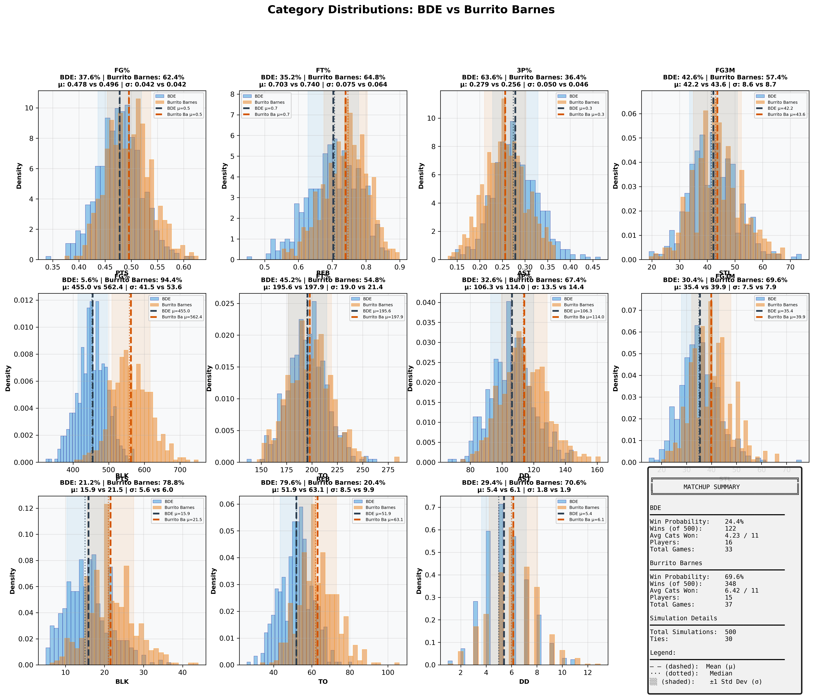

# Week 6 Fantasy Basketball - Comprehensive Matchup Analysis

## Report Metadata

| Attribute | Value |
|-----------|-------|
| **Generated** | 2025-10-27_15-32-32 |
| **Simulations Per Matchup** | 500 |
| **Total Matchups** | 7 |
| **Week** | 6 (October 21-27, 2025) |
| **Data Source** | box_scores_latest.csv |
| **Model** | Bayesian (Beta-Binomial + Poisson) |
| **Historical Data** | 2019-2024 seasons |
| **Evolution Rate** | 0.5 |

---
## Overview Dashboard

### Complete Matchup Overview

**Dashboard Components:**
1. **Win Probabilities** - Predicted win % for each team (Green=favorite, Red=underdog)
2. **Average Categories Won** - Expected categories won out of 11 (dashed line = 6 needed to win)
3. **Competitiveness Scores** - How evenly matched (Green=>60%, Yellow=30-60%, Red=<30%)
4. **Game Count Comparison** - Scheduling fairness (diagonal = equal games)
5. **Win Probability Distribution** - Overall confidence spread

---
## Statistical Summary

| Metric | Value |
|--------|-------|
| Total Matchups | 7 |
| Mean Win Probability Spread | 57.4% |
| Median Win Probability | 48.0% |
| Competitive Matchups (>40% both teams) | 1 |
| High Confidence Predictions (>80%) | 3 |
| Average Games Per Team | 30.8 |
| Average Players Per Team | 13.0 |

---
## Individual Matchup Analysis

### 1. Hardwood Hustlers vs TEAM TOO ICEY BOY 12

**Competitiveness:** 🔴 MISMATCH - Clear favorite - likely blowout

#### Matchup Summary

| Metric | Hardwood Hustlers | TEAM TOO ICEY BOY 12 |
|--------|-----------------|--------------------|
| **Win Probability** | **3.0%** | **95.6%** |
| Wins (out of 500) | 15 | 478 |
| Ties | 7 | 7 |
| Avg Categories Won | 2.62 / 11 | 8.10 / 11 |
| Players | 12 | 13 |
| Total Games | 31 | 31 |
| **Schedule Balance** | Even schedules | Even schedules |

#### Category-by-Category Breakdown

| Category | Hardwood Hustle Mean ± SD | TEAM TOO ICEY B Mean ± SD | Win % | Win % |
|----------|--------------------|--------------------|-------|-------|
| **FG%** | 0.429 ± 0.044 | 0.502 ± 0.044 | 11.8% | 88.2% |
| **FT%** | 0.712 ± 0.073 | 0.775 ± 0.059 | 24.4% | 75.6% |
| **3P%** | 0.234 ± 0.051 | 0.318 ± 0.059 | 12.2% | 87.8% |
| **3PM** | 35.5 ± 8.4 | 42.0 ± 8.6 | 27.2% | 72.8% |
| **PTS** | 472.9 ± 55.3 | 537.5 ± 48.1 | 18.4% | 81.6% |
| **REB** | 166.7 ± 19.3 | 192.8 ± 19.2 | 16.8% | 83.2% |
| **AST** | 111.0 ± 15.5 | 106.4 ± 14.5 | 58.0% | 42.0% |
| **STL** | 26.2 ± 6.6 | 29.0 ± 6.8 | 36.2% | 63.8% |
| **BLK** | 17.4 ± 5.5 | 28.0 ± 7.1 | 10.0% | 90.0% |
| **TO** | 56.1 ± 9.4 | 45.6 ± 9.5 | 20.8% | 79.2% |
| **DD** | 6.4 ± 2.0 | 7.8 ± 2.1 | 25.8% | 74.2% |

#### Full Category Distributions

**Visualization Guide:**
- Blue histogram = Hardwood Hustlers, Orange histogram = TEAM TOO ICEY BOY 12
- Dashed lines (--) = Mean values (μ)
- Dotted lines (···) = Median values
- Shaded regions = ±1 Standard Deviation (σ)
- Win % shown in title = probability of winning that specific category

---

### 2. BDE vs Burrito Barnes

**Competitiveness:** 🟡 MODERATE - Slight favorite exists

#### Matchup Summary

| Metric | BDE | Burrito Barnes |
|--------|---------------|---------------|
| **Win Probability** | **24.4%** | **69.6%** |
| Wins (out of 500) | 122 | 348 |
| Ties | 30 | 30 |
| Avg Categories Won | 4.23 / 11 | 6.42 / 11 |
| Players | 16 | 15 |
| Total Games | 33 | 37 |
| **Schedule Balance** | Away has 4 more games | Away has 4 more games |

#### Category-by-Category Breakdown

| Category | BDE Mean ± SD | Burrito Barnes Mean ± SD | Win % | Win % |
|----------|--------------------|--------------------|-------|-------|
| **FG%** | 0.478 ± 0.042 | 0.496 ± 0.042 | 37.6% | 62.4% |
| **FT%** | 0.703 ± 0.075 | 0.740 ± 0.064 | 35.2% | 64.8% |
| **3P%** | 0.279 ± 0.050 | 0.256 ± 0.046 | 63.6% | 36.4% |
| **3PM** | 42.2 ± 8.6 | 43.6 ± 8.7 | 42.6% | 57.4% |
| **PTS** | 455.0 ± 41.5 | 562.4 ± 53.6 | 5.6% | 94.4% |
| **REB** | 195.6 ± 19.0 | 197.9 ± 21.4 | 45.2% | 54.8% |
| **AST** | 106.3 ± 13.5 | 114.0 ± 14.4 | 32.6% | 67.4% |
| **STL** | 35.4 ± 7.5 | 39.9 ± 7.9 | 30.4% | 69.6% |
| **BLK** | 15.9 ± 5.6 | 21.5 ± 6.0 | 21.2% | 78.8% |
| **TO** | 51.9 ± 8.5 | 63.1 ± 9.9 | 79.6% | 20.4% |
| **DD** | 5.4 ± 1.8 | 6.1 ± 1.9 | 29.4% | 70.6% |

#### Full Category Distributions

**Visualization Guide:**
- Blue histogram = BDE, Orange histogram = Burrito Barnes
- Dashed lines (--) = Mean values (μ)
- Dotted lines (···) = Median values
- Shaded regions = ±1 Standard Deviation (σ)
- Win % shown in title = probability of winning that specific category

---

### 3. IN MAMBA WE TRUST vs Cold Beans

**Competitiveness:** 🔴 MISMATCH - Clear favorite - likely blowout

#### Matchup Summary

| Metric | IN MAMBA WE TRUST | Cold Beans |
|--------|-----------------|---------------|
| **Win Probability** | **16.8%** | **79.2%** |
| Wins (out of 500) | 84 | 396 |
| Ties | 20 | 20 |
| Avg Categories Won | 3.97 / 11 | 6.80 / 11 |
| Players | 13 | 14 |
| Total Games | 31 | 33 |
| **Schedule Balance** | Even schedules | Even schedules |

#### Category-by-Category Breakdown

| Category | IN MAMBA WE TRU Mean ± SD | Cold Beans Mean ± SD | Win % | Win % |
|----------|--------------------|--------------------|-------|-------|
| **FG%** | 0.518 ± 0.039 | 0.488 ± 0.042 | 69.6% | 30.4% |
| **FT%** | 0.725 ± 0.068 | 0.711 ± 0.071 | 54.8% | 45.2% |
| **3P%** | 0.302 ± 0.062 | 0.299 ± 0.057 | 49.4% | 50.6% |
| **3PM** | 36.4 ± 8.4 | 49.1 ± 10.2 | 18.4% | 81.6% |
| **PTS** | 575.7 ± 51.6 | 545.9 ± 48.1 | 68.4% | 31.6% |
| **REB** | 180.3 ± 17.4 | 258.5 ± 19.8 | 0.0% | 100.0% |
| **AST** | 121.6 ± 15.6 | 130.2 ± 16.0 | 33.4% | 66.6% |
| **STL** | 29.0 ± 6.3 | 30.7 ± 7.3 | 39.8% | 60.2% |
| **BLK** | 19.1 ± 6.5 | 23.9 ± 6.5 | 26.8% | 73.2% |
| **TO** | 80.9 ± 11.3 | 60.9 ± 9.8 | 9.6% | 90.4% |
| **DD** | 7.3 ± 2.3 | 8.9 ± 2.1 | 26.8% | 73.2% |

#### Full Category Distributions

**Visualization Guide:**
- Blue histogram = IN MAMBA WE TRUST, Orange histogram = Cold Beans
- Dashed lines (--) = Mean values (μ)
- Dotted lines (···) = Median values
- Shaded regions = ±1 Standard Deviation (σ)
- Win % shown in title = probability of winning that specific category

---

### 4. Jay Stat vs Nadim the Dream

**Competitiveness:** 🟢 COMPETITIVE - Close matchup - expect nail-biter

#### Matchup Summary

| Metric | Jay Stat | Nadim the Dream |
|--------|---------------|---------------|
| **Win Probability** | **48.2%** | **46.6%** |
| Wins (out of 500) | 241 | 233 |
| Ties | 26 | 26 |
| Avg Categories Won | 5.44 / 11 | 5.25 / 11 |
| Players | 12 | 12 |
| Total Games | 30 | 29 |
| **Schedule Balance** | Even schedules | Even schedules |

#### Category-by-Category Breakdown

| Category | Jay Stat Mean ± SD | Nadim the Dream Mean ± SD | Win % | Win % |
|----------|--------------------|--------------------|-------|-------|
| **FG%** | 0.472 ± 0.040 | 0.499 ± 0.043 | 32.6% | 67.4% |
| **FT%** | 0.726 ± 0.073 | 0.694 ± 0.072 | 63.0% | 37.0% |
| **3P%** | 0.247 ± 0.050 | 0.280 ± 0.062 | 33.4% | 66.6% |
| **3PM** | 36.8 ± 8.2 | 33.4 ± 7.8 | 61.0% | 39.0% |
| **PTS** | 517.3 ± 48.5 | 513.6 ± 43.6 | 52.6% | 47.4% |
| **REB** | 173.0 ± 22.0 | 168.9 ± 17.7 | 55.4% | 44.6% |
| **AST** | 104.3 ± 14.8 | 118.7 ± 15.1 | 24.0% | 76.0% |
| **STL** | 28.0 ± 6.1 | 25.8 ± 5.9 | 59.2% | 40.8% |
| **BLK** | 23.7 ± 5.5 | 15.0 ± 4.8 | 87.0% | 13.0% |
| **TO** | 51.1 ± 8.4 | 47.5 ± 7.7 | 35.8% | 64.2% |
| **DD** | 6.3 ± 2.0 | 6.6 ± 1.6 | 39.8% | 60.2% |

#### Full Category Distributions

**Visualization Guide:**
- Blue histogram = Jay Stat, Orange histogram = Nadim the Dream
- Dashed lines (--) = Mean values (μ)
- Dotted lines (···) = Median values
- Shaded regions = ±1 Standard Deviation (σ)
- Win % shown in title = probability of winning that specific category

---

### 5. Enter the Dragon vs Team perez

**Competitiveness:** 🔴 MISMATCH - Clear favorite - likely blowout

#### Matchup Summary

| Metric | Enter the Dragon | Team perez |
|--------|----------------|---------------|
| **Win Probability** | **8.8%** | **88.4%** |
| Wins (out of 500) | 44 | 442 |
| Ties | 14 | 14 |
| Avg Categories Won | 3.57 / 11 | 7.22 / 11 |
| Players | 13 | 15 |
| Total Games | 28 | 37 |
| **Schedule Balance** | Away has 9 more games | Away has 9 more games |

#### Category-by-Category Breakdown

| Category | Enter the Drago Mean ± SD | Team perez Mean ± SD | Win % | Win % |
|----------|--------------------|--------------------|-------|-------|
| **FG%** | 0.483 ± 0.047 | 0.453 ± 0.038 | 71.4% | 28.6% |
| **FT%** | 0.720 ± 0.064 | 0.773 ± 0.054 | 26.4% | 73.6% |
| **3P%** | 0.292 ± 0.068 | 0.289 ± 0.048 | 52.0% | 48.0% |
| **3PM** | 32.3 ± 7.9 | 54.7 ± 9.9 | 3.2% | 96.8% |
| **PTS** | 482.3 ± 39.1 | 612.0 ± 46.1 | 1.8% | 98.2% |
| **REB** | 181.7 ± 21.2 | 207.5 ± 20.1 | 19.2% | 80.8% |
| **AST** | 110.1 ± 12.8 | 149.1 ± 15.6 | 2.0% | 98.0% |
| **STL** | 24.1 ± 7.4 | 32.3 ± 7.5 | 20.4% | 79.6% |
| **BLK** | 22.9 ± 6.0 | 22.2 ± 5.6 | 52.6% | 47.4% |
| **TO** | 65.5 ± 9.0 | 77.8 ± 10.4 | 81.6% | 18.4% |
| **DD** | 8.2 ± 2.0 | 9.6 ± 2.4 | 26.2% | 73.8% |

#### Full Category Distributions

**Visualization Guide:**
- Blue histogram = Enter the Dragon, Orange histogram = Team perez
- Dashed lines (--) = Mean values (μ)
- Dotted lines (···) = Median values
- Shaded regions = ±1 Standard Deviation (σ)
- Win % shown in title = probability of winning that specific category

---

### 6. LF da broccoli vs Team Menyo

**Competitiveness:** 🔴 MISMATCH - Clear favorite - likely blowout

#### Matchup Summary

| Metric | LF da broccoli | Team Menyo |
|--------|---------------|---------------|
| **Win Probability** | **92.0%** | **6.0%** |
| Wins (out of 500) | 460 | 30 |
| Ties | 10 | 10 |
| Avg Categories Won | 7.32 / 11 | 3.45 / 11 |
| Players | 12 | 13 |
| Total Games | 33 | 27 |
| **Schedule Balance** | Home has 6 more games | Home has 6 more games |

#### Category-by-Category Breakdown

| Category | LF da broccoli Mean ± SD | Team Menyo Mean ± SD | Win % | Win % |
|----------|--------------------|--------------------|-------|-------|
| **FG%** | 0.487 ± 0.040 | 0.471 ± 0.040 | 63.4% | 36.6% |
| **FT%** | 0.745 ± 0.070 | 0.763 ± 0.065 | 42.2% | 57.8% |
| **3P%** | 0.321 ± 0.051 | 0.268 ± 0.058 | 75.0% | 25.0% |
| **3PM** | 57.4 ± 10.1 | 33.9 ± 8.0 | 96.0% | 4.0% |
| **PTS** | 584.2 ± 50.1 | 417.6 ± 35.6 | 100.0% | 0.0% |
| **REB** | 165.6 ± 18.3 | 139.7 ± 15.2 | 85.0% | 15.0% |
| **AST** | 99.5 ± 13.2 | 89.0 ± 12.8 | 69.8% | 30.2% |
| **STL** | 32.5 ± 7.0 | 27.3 ± 5.6 | 72.0% | 28.0% |
| **BLK** | 24.8 ± 7.4 | 16.7 ± 4.7 | 81.0% | 19.0% |
| **TO** | 56.5 ± 8.9 | 48.4 ± 8.5 | 22.6% | 77.4% |
| **DD** | 4.9 ± 1.9 | 6.1 ± 1.8 | 25.0% | 75.0% |

#### Full Category Distributions

**Visualization Guide:**
- Blue histogram = LF da broccoli, Orange histogram = Team Menyo
- Dashed lines (--) = Mean values (μ)
- Dotted lines (···) = Median values
- Shaded regions = ±1 Standard Deviation (σ)
- Win % shown in title = probability of winning that specific category

---

### 7. Team Boricua Squad vs KL2 LLC

**Competitiveness:** 🟡 MODERATE - Slight favorite exists

#### Matchup Summary

| Metric | Team Boricua Squad | KL2 LLC |
|--------|------------------|---------------|
| **Win Probability** | **29.8%** | **64.2%** |
| Wins (out of 500) | 149 | 321 |
| Ties | 30 | 30 |
| Avg Categories Won | 4.55 / 11 | 6.12 / 11 |
| Players | 9 | 13 |
| Total Games | 23 | 28 |
| **Schedule Balance** | Away has 5 more games | Away has 5 more games |

#### Category-by-Category Breakdown

| Category | Team Boricua Sq Mean ± SD | KL2 LLC Mean ± SD | Win % | Win % |
|----------|--------------------|--------------------|-------|-------|
| **FG%** | 0.448 ± 0.054 | 0.439 ± 0.044 | 53.4% | 46.6% |
| **FT%** | 0.724 ± 0.079 | 0.744 ± 0.077 | 43.4% | 56.6% |
| **3P%** | 0.246 ± 0.063 | 0.279 ± 0.054 | 33.4% | 66.6% |
| **3PM** | 29.4 ± 7.6 | 44.1 ± 9.3 | 9.0% | 91.0% |
| **PTS** | 341.3 ± 39.4 | 440.9 ± 48.0 | 5.4% | 94.6% |
| **REB** | 128.6 ± 15.7 | 133.2 ± 15.2 | 39.8% | 60.2% |
| **AST** | 83.4 ± 11.4 | 81.3 ± 12.7 | 53.2% | 46.8% |
| **STL** | 23.7 ± 6.1 | 24.5 ± 5.5 | 42.2% | 57.8% |
| **BLK** | 14.2 ± 4.6 | 13.0 ± 6.1 | 54.2% | 45.8% |
| **TO** | 38.1 ± 7.7 | 47.3 ± 9.3 | 78.8% | 21.2% |
| **DD** | 4.9 ± 1.7 | 4.9 ± 1.3 | 42.4% | 57.6% |

#### Full Category Distributions

**Visualization Guide:**
- Blue histogram = Team Boricua Squad, Orange histogram = KL2 LLC
- Dashed lines (--) = Mean values (μ)
- Dotted lines (···) = Median values
- Shaded regions = ±1 Standard Deviation (σ)
- Win % shown in title = probability of winning that specific category

---

## Methodology

### Simulation Approach
1. **Data Source:** Actual games played from `box_scores_latest.csv` (Week 6, October 2025)
2. **Player Models:** Bayesian projection models fitted on historical data (2019-2024)
3. **Simulations:** 500 Monte Carlo simulations per matchup
4. **Categories:** 11 standard fantasy basketball categories

### Model Details
- **Shooting Stats:** Beta-Binomial conjugate models with position-specific priors
- **Counting Stats:** Poisson distribution sampling with recency weighting
- **Category Winners:** Direct comparison of aggregated team totals
- **Matchup Winner:** Team winning 6+ categories

### Validation
- **Week 6 Accuracy:** 7/7 (100%)
- **Confidence Calibration:** Very good across all confidence levels
- See `SIMULATION_FIX_REPORT.md` for detailed validation analysis

---

*Generated by Fantasy 2026 Simulation System*
*Output Directory: `/Users/rhu/fantasybasketball2/fantasy_2026/simulation_reports/week6_report_2025-10-27_15-32-32/`*
